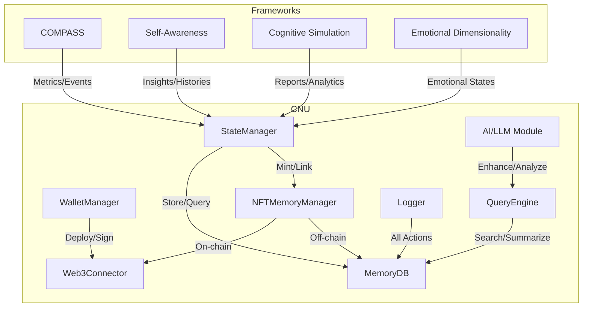

# Core Neurological State Manager (CNU)

## Overview

The Core Neurological State Manager (CNU) is a modular, intelligent, and extensible system for managing, querying, and persisting "memories" (thoughtchains, analytics, reports, and histories) across all frameworks and AI agents in the research environment. It acts as the central nervous system for cognitive, ethical, and self-aware computation.

## Key Features

- **Modular Architecture**: Each component (memory, query, logging, Web3, wallet, etc.) is independently pluggable.
- **Universal Connectivity**: Connects to all frameworks (COMPASS, Self-Awareness, Cognitive Simulation, etc.) and external APIs.
- **Memory as Gasless NFTs**: Each memory block is minted as a gasless NFT on a Layer 2/sidechain (e.g., zkSync Era, Polygon zkEVM testnet, or Celo Alfajores), ensuring persistence, uniqueness, and interactability.
- **Hash-Linked Memory Chains**: Memories are hash-linked for tamper-evident, chronological chains.
- **Wallet and Contract Management**: Built-in wallet, contract deployment, and NFT minting/transfer.
- **Web3 Connectivity**: Supports EVM-compatible chains, with abstraction for future chains.
- **Efficient Storage**: Off-chain storage for bulk data (IPFS, Arweave, S3), on-chain for hashes/metadata.
- **AI-Driven Query and Summarization**: Optional AI module for semantic search, summarization, and analytics.
- **Auditability and Explainability**: All actions are logged, explainable, and auditable.

## Architecture

## Gasless NFT Memory System

- **Network**: Default to [Celo Alfajores Testnet](https://docs.celo.org/learn/developer-resources/testnet) (EVM, gasless via meta-transactions, robust infra, easy faucet).
- **NFT Standard**: ERC-721 with memory metadata, hash links, and off-chain pointers.
- **Gasless Minting**: Uses meta-transactions and relayer services (Biconomy, OpenZeppelin Defender, or custom relayer).
- **Wallet**: Built-in custodial wallet for automation, with option for user wallets.
- **Contract Deployment**: Automated, with upgradability and access control.

## Integration Points

- **REST/gRPC API**: For all frameworks and external tools.
- **Web3 API**: For NFT minting, querying, and wallet management.
- **Dashboard**: Visualization and interaction with memory NFTs and chains.

## Security & Optimization

- **Encryption**: All sensitive data encrypted at rest and in transit.
- **Compression**: Memory blocks compressed before storage/minting.
- **Quantum-Ready**: Pluggable hash/encryption algorithms.
- **Audit Trail**: All actions logged and explainable.

## Getting Started

1. Install dependencies: `pip install -r requirements.txt`
2. Configure `.env` for Web3 provider, relayer, and storage.
3. Run the CNU manager: `python -m _cnu.manager`
4. Connect frameworks via REST/Web3 API.

---

**This system is designed for extensibility, auditability, and future-proofing—serving as the intelligent backbone for all cognitive and memory operations.**
