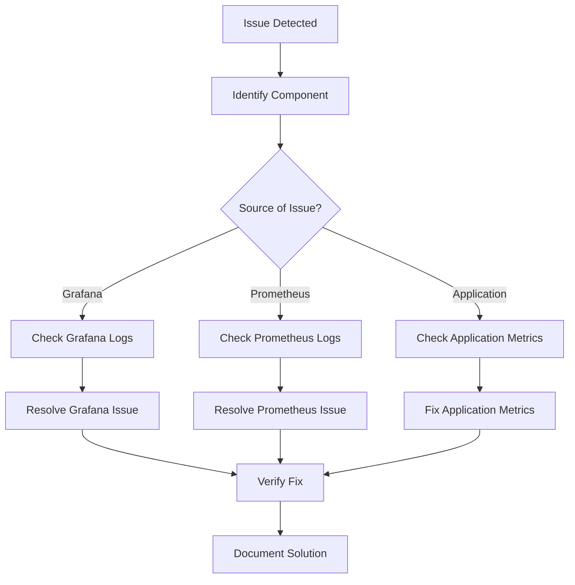
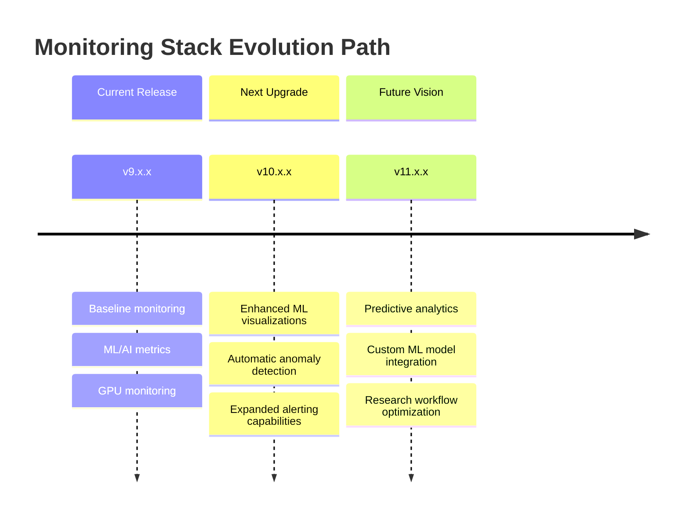
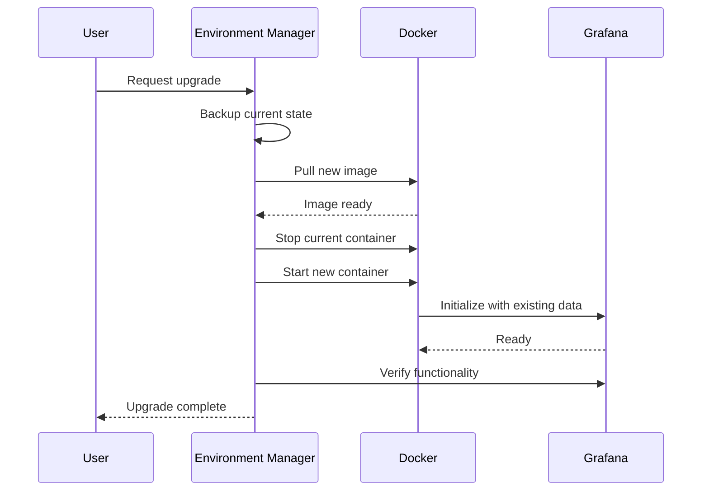

# Grafana Configuration

This document describes the Grafana setup in the AI Research Environment, including its configuration, dashboards, and usage.

## Overview

Grafana is used in the research environment to visualize metrics collected by Prometheus. It provides intuitive dashboards that help monitor the performance and health of the research application and infrastructure, including specialized ML and GPU metrics.

## Integration with Environment Manager

Grafana is now fully integrated with the unified `environment_manager.py` script, making it easy to enable/disable and configure:

```bash
# Start with default Grafana settings
python environment_manager.py --enable-monitoring

# Customize Grafana credentials
python environment_manager.py --enable-monitoring --grafana-user researcher --grafana-password secure123

# Customize Grafana port
python environment_manager.py --enable-monitoring --monitor-port 3030
```

## Docker Configuration

Grafana runs as a Docker container with the following configuration (from `head_1/docker-compose.yml`):

```yaml
grafana:
  image: grafana/grafana:latest
  container_name: grafana
  restart: unless-stopped
  ports:
    - "${MONITOR_PORT:-3000}:3000"
  volumes:
    - ../monitoring/grafana/provisioning:/etc/grafana/provisioning
    - grafana_data:/var/lib/grafana
  environment:
    - GF_SECURITY_ADMIN_USER=${GRAFANA_USER:-admin}
    - GF_SECURITY_ADMIN_PASSWORD=${GRAFANA_PASSWORD:-admin}
    - GF_USERS_ALLOW_SIGN_UP=false
  depends_on:
    - prometheus
```

## Key Features

### Authentication

- Default username: `admin`
- Default password: `admin`
- These credentials can be customized using the `--grafana-user` and `--grafana-password` options
- User registration is disabled by default

### Persistent Storage

Dashboard configurations and user settings are stored in a Docker volume (`grafana_data`) to ensure data persistence across container restarts.

### Dashboard Provisioning

Dashboards are automatically provisioned from the `monitoring/grafana/provisioning` directory. This means dashboards are available immediately when Grafana starts, without manual configuration.

## Enhanced Dashboards

### AI Research Environment Dashboard

This comprehensive dashboard provides real-time monitoring of all aspects of the research environment:

- **System Metrics**:
  - CPU usage and load
  - Memory utilization
  - Disk I/O and space
  - Network traffic
  
- **Container Metrics**:
  - Container CPU usage
  - Container memory usage
  - Container disk I/O
  - Container network activity
  
- **GPU Metrics** (when GPU is available):
  - GPU utilization percentage
  - GPU memory usage
  - GPU temperature
  - GPU power usage
  
- **ML Framework Metrics**:
  - Model training batch times
  - Inference latency
  - Dataset loading times
  - Memory usage during training

### Performance Analysis Dashboard

Specialized dashboard for analyzing performance bottlenecks:

- CPU vs GPU utilization comparison
- Memory allocation breakdowns
- I/O wait analysis
- Network saturation monitoring

### ML/AI Workflow Dashboard

Specialized dashboard for tracking ML/AI workloads:

- Training metrics over time
- Model comparison views
- Hyperparameter tracking
- Resource efficiency metrics

## Dashboard Details

### CPU Usage Panel

- **Metric**: `100 - (avg by (instance) (irate(node_cpu_seconds_total{mode="idle"}[1m])) * 100)`
- **Visualization**: Line graph
- **Purpose**: Shows CPU utilization over time (percentage)
- **Thresholds**:
  - 0-70%: Green
  - 70-90%: Yellow
  - >90%: Red

### Memory Usage Panel

- **Metric**: `100 * (node_memory_MemTotal_bytes - node_memory_MemFree_bytes - node_memory_Buffers_bytes - node_memory_Cached_bytes) / node_memory_MemTotal_bytes`
- **Visualization**: Line graph
- **Purpose**: Shows memory utilization over time (percentage)
- **Thresholds**:
  - 0-80%: Green
  - 80-95%: Yellow
  - >95%: Red

### GPU Utilization Panel

- **Metric**: `nvidia_gpu_utilization_percentage`
- **Visualization**: Line graph
- **Purpose**: Shows GPU utilization over time (percentage)
- **Thresholds**:
  - 0-70%: Green
  - 70-95%: Yellow
  - >95%: Red

### GPU Memory Panel

- **Metric**: `nvidia_gpu_memory_used_bytes / nvidia_gpu_memory_total_bytes * 100`
- **Visualization**: Line graph
- **Purpose**: Shows GPU memory utilization over time (percentage)
- **Thresholds**:
  - 0-80%: Green
  - 80-95%: Yellow
  - >95%: Red

### ML Training Metrics Panel

- **Metric**: `ml_training_batch_duration_seconds` (custom metric)
- **Visualization**: Line graph
- **Purpose**: Tracks training batch processing times
- **Thresholds**: None

## Extending Grafana

### Adding Custom Metrics

To add custom metrics from your ML/AI applications:

1. Instrument your Python code with Prometheus client:
```python
from prometheus_client import Counter, Gauge, Summary, Histogram

# Create metrics
batch_counter = Counter('ml_batches_processed', 'Number of batches processed')
loss_gauge = Gauge('ml_training_loss', 'Current training loss value')
training_time = Histogram('ml_training_batch_duration_seconds', 
                         'Histogram of training times per batch',
                         buckets=[0.1, 0.5, 1.0, 5.0, 10.0, 30.0, 60.0])

# Use in your code
def train_batch(batch_data):
    start_time = time.time()
    loss = model.train(batch_data)
    
    # Record metrics
    duration = time.time() - start_time
    batch_counter.inc()
    loss_gauge.set(loss)
    training_time.observe(duration)
```

2. The metrics will automatically be collected by Prometheus

3. Create a new dashboard panel in Grafana to visualize your custom metrics

### Creating New Dashboards

To create a new dashboard:

1. Click "+" > "Dashboard" in the left sidebar
2. Click "Add new panel"
3. Use the query editor to select metrics from Prometheus
4. Configure visualization options (graph, gauge, table, etc.)
5. Set panel title and description
6. Save the dashboard with a descriptive name

### Dashboard Variables

The research environment dashboards include variables for:

- **Time range**: Select different time intervals
- **Instance**: Select specific containers or services
- **GPU**: Select specific GPUs when multiple are available
- **Dataset**: Filter metrics by dataset name
- **Model**: Filter metrics by model name

## Alerting

Grafana can be configured to send alerts based on metric thresholds:

1. Open a panel in edit mode
2. Select the "Alert" tab
3. Configure alert conditions and notifications
4. Save the alert

Common alert rules include:
- High memory usage (>90%)
- High GPU memory usage (>95%)
- Long training batch times (>10s)
- Disk space running low (<10% free)

## Error Handling & Troubleshooting

### Comprehensive Error Resolution Framework

When encountering issues with Grafana in the research environment, follow this structured approach:

1. **Identify**: Determine if the issue is with Grafana, Prometheus, or your application metrics
2. **Isolate**: Check which specific component is failing
3. **Diagnose**: Use logs and diagnostics to understand the root cause
4. **Resolve**: Apply the appropriate solution
5. **Verify**: Confirm the fix resolves the issue
6. **Document**: Record the issue and solution for future reference



### Evolution and Upgrade Path

Grafana and Prometheus are designed to evolve with your research needs. Our monitoring stack follows a continuous improvement model:



#### Upgrade Process

To upgrade Grafana to a newer version:

1. **Backup current configuration and data**
   ```bash
   # Backup Grafana data
   python environment_manager.py --backup-monitoring
   ```

2. **Update the Docker image tag in your environment configuration**
   ```yaml
   # In monitoring/docker-compose.override.yml
   services:
     grafana:
       image: grafana/grafana:10.0.0  # Update to desired version
   ```

3. **Apply the upgrade**
   ```bash
   python environment_manager.py --upgrade-monitoring
   ```

4. **Verify the upgrade**
   ```bash
   python environment_manager.py --verify-monitoring
   ```



### Implementation: Automated Recovery Scripts

We've implemented several automated recovery mechanisms to handle common Grafana issues:

#### Self-Healing Monitoring Stack

The `monitoring_recovery.py` script provides automated recovery for common monitoring issues:

```python
# Example usage:
python utils/monitoring_recovery.py --service grafana --action diagnose
python utils/monitoring_recovery.py --service grafana --action repair
python utils/monitoring_recovery.py --service all --action verify
```

#### Health Check Implementation

The monitoring health check is implemented in `cron` to automatically detect and repair issues:

```bash
# Add to crontab
(crontab -l 2>/dev/null; echo "*/10 * * * * /workspaces/research/utils/monitoring_health_check.sh") | crontab -
```

Example implementation of `monitoring_health_check.sh`:

```bash
#!/bin/bash
# Check Grafana health
GRAFANA_STATUS=$(curl -s -o /dev/null -w "%{http_code}" http://localhost:3000/api/health)

if [ "$GRAFANA_STATUS" != "200" ]; then
  echo "Grafana health check failed. Attempting recovery..."
  python /workspaces/research/utils/monitoring_recovery.py --service grafana --action repair
  
  # Notify admin if recovery attempt was necessary
  echo "Grafana recovery attempted at $(date)" | mail -s "Grafana Recovery Alert" admin@example.com
fi
```

#### Config Validation Hook

Pre-commit hook to validate Grafana dashboard configuration before deployment:

```bash
#!/bin/bash
# Pre-commit hook for dashboard validation
for file in $(git diff --cached --name-only | grep -E 'monitoring/grafana/provisioning/.*\.json$')
do
  python /workspaces/research/utils/validate_dashboard.py "$file" || exit 1
done
```

### Common Issues and Solutions

#### Connection Issues

1. **Grafana Cannot Connect to Prometheus**
   - **Symptoms**: "No data points" error, empty graphs
   - **Possible Causes**:
     - Prometheus container is not running
     - Network connectivity issues between containers
     - Incorrect data source URL configuration
   - **Solutions**:
     - Verify Prometheus is running: `docker ps | grep prometheus`
     - Check Prometheus logs: `docker logs prometheus`
     - Verify data source configuration in Grafana UI (Admin → Data Sources)
     - Ensure proper network configuration in docker-compose.yml
   - **Verification**: Run `curl -s http://prometheus:9090/-/healthy` from within the Grafana container

#### Authentication Failures

1. **Symptoms**: Unable to log in, "Invalid username or password" errors
   - **Possible Causes**:
     - Misconfigured environment variables
     - Grafana container restarted with new credentials but using old data volume
   - **Solutions**:
     - Verify environment variables are correctly set
     - Reset admin password using Grafana CLI:
       ```bash
       docker exec -it grafana grafana-cli admin reset-admin-password newpassword
       ```
     - Check permission on grafana_data volume

#### Dashboard Issues

1. **Missing Metrics or Panels**
   - **Symptoms**: Empty panels, "No data points" error on specific panels
   - **Possible Causes**:
     - Missing exporters for specific metrics
     - Incorrect metric queries
     - Metrics not being collected
   - **Solutions**:
     - Verify metric exists in Prometheus: browse to Prometheus UI (usually at :9090)
     - Check exporter logs for errors
     - Review panel query syntax for errors

2. **High Dashboard Load Times**
   - **Symptoms**: Dashboards take a long time to load or refresh
   - **Possible Causes**:
     - Too many panels or queries
     - Inefficient queries
     - Time range too large
   - **Solutions**:
     - Reduce time range in dashboard
     - Optimize queries using rate(), increase scrape intervals
     - Split complex dashboards into multiple simpler ones

### GPU-Specific Error Handling

For research environments using GPUs, additional error handling is necessary:

1. **NVIDIA Driver/CUDA Mismatch**
   - **Symptoms**: Missing GPU metrics, DCGM exporter failures
   - **Solutions**:
     - Check NVIDIA driver compatibility: `nvidia-smi`
     - Verify DCGM is running: `docker ps | grep dcgm`
     - Restart NVIDIA services: `sudo systemctl restart nvidia-dcgm`

2. **GPU Metric Collection Failures**
   - **Symptoms**: Incomplete GPU data, gaps in GPU metrics
   - **Solutions**:
     - Check DCGM exporter logs: `docker logs dcgm-exporter`
     - Verify GPU visibility to Docker: `docker run --rm --gpus all nvidia/cuda:11.0-base nvidia-smi`
     - Restart the nvidia-container-toolkit: `sudo systemctl restart nvidia-container-toolkit`

3. **GPU Throttling Detection**
   - **Symptoms**: Unexpected performance drops in GPU-intensive workloads
   - **Diagnosis**: 
     ```bash
     docker exec dcgm-exporter dcgmi dmon -e 1001,1002,1003
     ```
   - **Solutions**:
     - Check for thermal throttling: `nvidia-smi -q -d TEMPERATURE`
     - Adjust GPU power limits if necessary: `nvidia-smi -pl <POWER_LIMIT>`

### Proactive Error Prevention

Implement these practices to minimize Grafana-related issues:

1. **Regular Health Checks**
   ```bash
   # Create a cron job to run every 15 minutes
   */15 * * * * /workspaces/research/scripts/monitoring_health_check.sh
   ```

2. **Automated Dashboard Backup**
   ```bash
   # Weekly dashboard backup
   0 0 * * 0 /workspaces/research/scripts/backup_grafana.sh
   ```

3. **Monitoring the Monitor**
   - Set up a secondary alerting system (like email or Slack notifications) that triggers if Grafana itself becomes unavailable
   - Configure `environment_manager.py` to periodically verify Grafana health:
     ```bash
     python environment_manager.py --verify-monitoring-health
     ```

4. **Resource Constraint Management**
   - Implement panel query limits to prevent resource exhaustion
   - Configure resource quotas for the Grafana container:
     ```yaml
     resources:
       limits:
         memory: 1G
         cpu: 0.5
     ```

### Advanced Debugging Techniques

For persistent or complex issues:

1. **Profiling Grafana Performance**
   ```bash
   # Generate CPU profile
   docker exec -it grafana curl 'http://localhost:3000/debug/pprof/profile' \
     --output grafana_cpu_profile.out
   ```

2. **Database Integrity Check**
   ```bash
   docker exec -it grafana grafana-cli admin database-integrity
   ```

3. **Plugin Compatibility Verification**
   ```bash
   docker exec -it grafana grafana-cli plugins ls
   ```

4. **Network Packet Analysis**
   ```bash
   # Capture traffic between Grafana and Prometheus
   docker run --net=container:grafana --rm -v $(pwd):/data nicolaka/netshoot \
     tcpdump -i any port 9090 -w /data/grafana_prom_traffic.pcap
   ```

### Error Response Templates

For documenting and reporting issues, use this template:
```markdown
# Error Report

## Summary
- **Issue**: [Brief description of the issue]
- **Impact**: [How the issue affects the system]

## Steps to Reproduce
1. [Step 1]
2. [Step 2]
3. [Step 3]

## Diagnosis
- **Logs**: [Relevant log entries]
- **Metrics**: [Affected metrics]
- **Configuration**: [Relevant configuration details]

## Resolution
- **Steps Taken**: [Actions performed to resolve the issue]
- **Outcome**: [Results of the resolution]

## Follow-Up
- [Preventative measures or additional actions]
```

## Accessing Grafana Logs

Logs are crucial for diagnosing issues with Grafana:

```bash
# View live Grafana logs
docker logs -f grafana

# Save logs to file for analysis
docker logs grafana > grafana_logs.txt

# View only error messages
docker logs grafana 2>&1 | grep -i error
```

Common log error patterns and solutions:

| Log Pattern | Likely Issue | Solution |
|-------------|--------------|----------|
| `Failed to connect to database` | Database initialization issue | Check volume permissions, restart container |
| `Data source connection failed` | Prometheus connectivity | Check network, Prometheus health |
| `Error updating dashboard` | Dashboard provisioning error | Check dashboard JSON for syntax errors |
| `User authentication failed` | Auth issues | Verify credentials, check auth configuration |

### Recovering from Failure

If the Grafana container fails to start or operate correctly:

1. **Check container status**:
   ```bash
   docker ps -a | grep grafana
   ```

2. **Backup data volume** before attempting fixes:
   ```bash
   docker run --rm -v grafana_data:/source -v $(pwd):/backup alpine tar -czf /backup/grafana_data_backup.tar.gz -C /source .
   ```

3. **Reset to default configuration** (preserving data):
   ```bash
   python environment_manager.py --reset-monitoring-config
   ```

4. **Complete reset** (including data, use with caution):
   ```bash
   python environment_manager.py --reset-monitoring --purge-data
   ```

### Diagnostics Script

Use the included diagnostics script to gather information about your Grafana setup:

```bash
python utils/monitoring_diagnostics.py --service grafana
```

This will output:
- Container status
- Port accessibility
- Data source connectivity
- Dashboard provisioning status
- Recent error logs
- Configuration validation

For persistent Grafana issues, please consult the [official Grafana troubleshooting guide](https://grafana.com/docs/grafana/latest/troubleshooting/) or open an issue in the project repository.

## Integration with System Diagnostics

The monitoring system integrates with the `diagnostics.py` utility to provide comprehensive system information:

```python
from utils.diagnostics import run_diagnostics

# Run diagnostics and get system information
diagnostics_data = run_diagnostics()

# View specific metric
gpu_util = diagnostics_data['system']['gpu']['utilization']
print(f"Current GPU utilization: {gpu_util}%")
```

For more details on custom metrics and diagnostics integration, see the [Custom Metrics Integration](custom_metrics.md) guide.