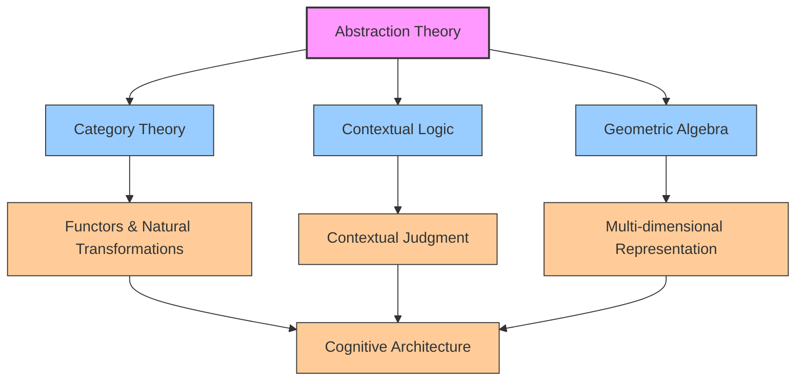
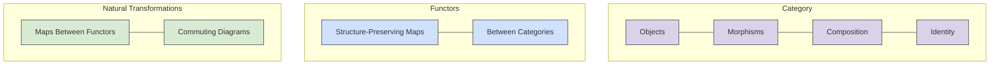
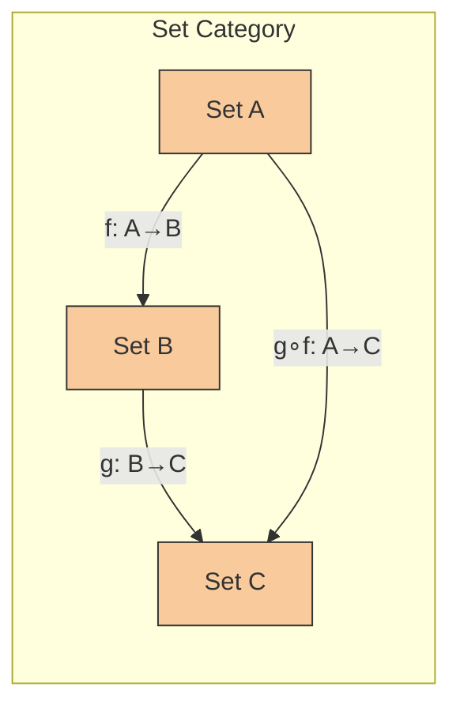
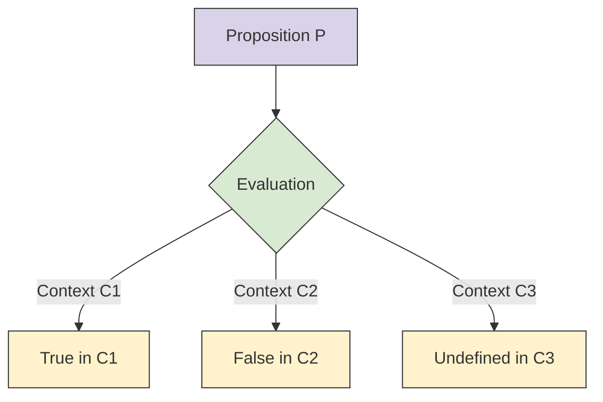
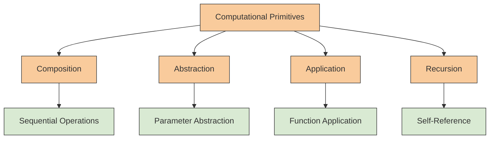
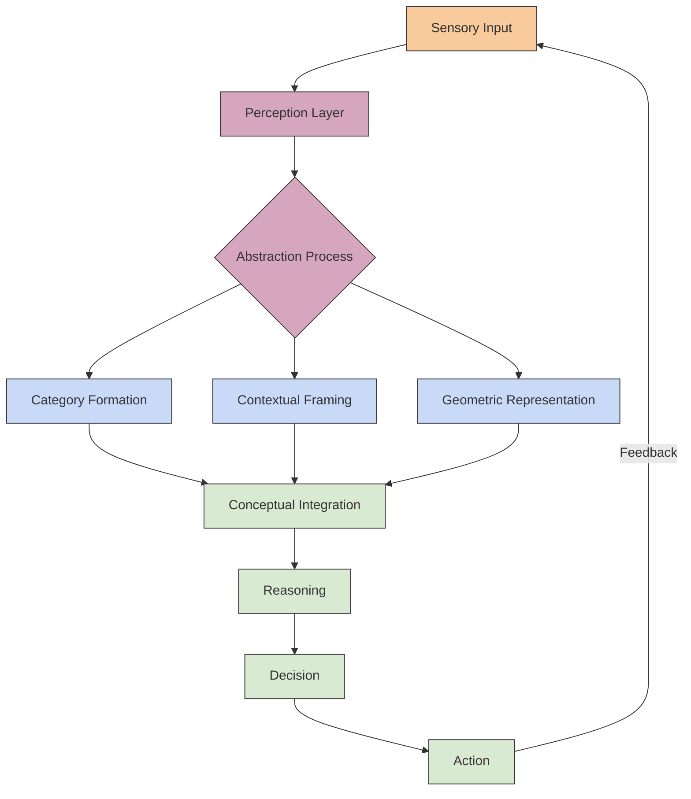
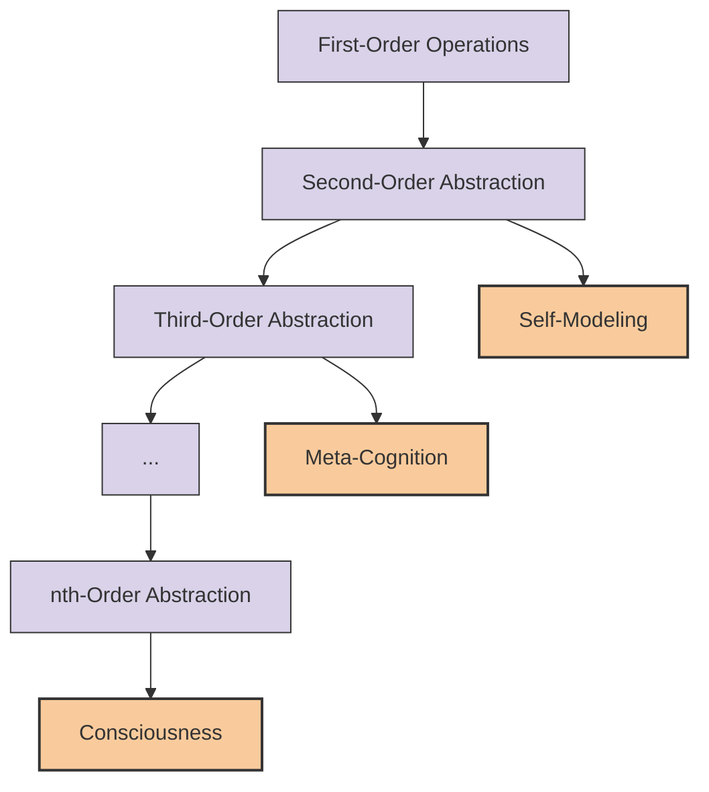
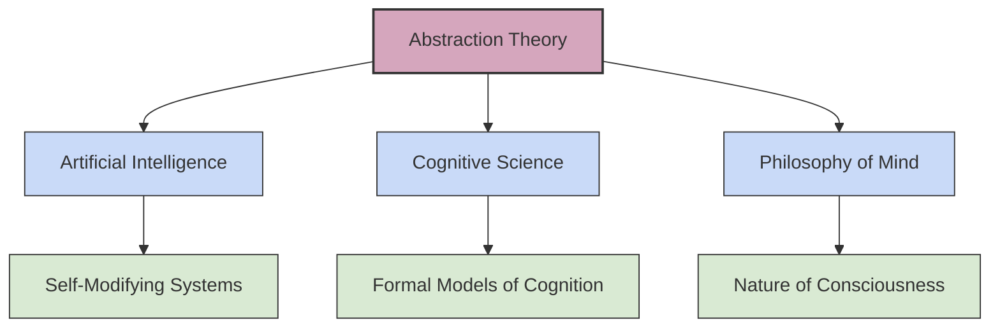

# Abstraction Theory: Categories, Contexts, and Cognition

## Introduction

This paper explores abstraction as a fundamental cognitive operation through the lens of category theory, offering a mathematical framework for understanding how mind emerges from formal operations on structured information.



## Category Theory Foundations

Category theory provides a unifying language for mathematics that focuses on relationships rather than objects themselves.

### Categories, Functors, and Natural Transformations



### Example: Category of Sets



## Contextual Logic

Contextual logic extends traditional logic by making validity dependent on context, allowing for more nuanced reasoning.



### Contextual Judgment System

| Judgment Form | Meaning | Example |
|---------------|---------|---------|
| C ⊢ P | P holds in context C | Math ⊢ 2+2=4 |
| C₁ ⊆ C₂ | Context C₁ is a subcontext of C₂ | Classical Physics ⊆ Physics |
| C₁ ⋈ C₂ | Contexts C₁ and C₂ are compatible | Newtonian Mechanics ⋈ Optics |
| C₁ ⊥ C₂ | Contexts C₁ and C₂ are incompatible | Quantum Physics ⊥ Classical Determinism |

## Computational Primitives



## Geometric Algebra

Geometric algebra provides a unified language for representing geometric concepts across dimensions, offering insights into multi-dimensional cognitive representations.

```mermaid
graph TD
    A[Geometric Algebra] --> B[Scalar]
    A --> C[Vector]
    A --> D[Bivector]
    A --> E[Trivector]
    A --> F[...(Higher Grades)]
    
    B & C & D & E & F --> G[Multivector]
    
    G --> H[Rotation]
    G --> I[Reflection]
    G --> J[Projection]
    
    classDef ga fill:#d5a6bd,stroke:#333;
    classDef element fill:#c9daf8,stroke:#333;
    classDef operation fill:#d9ead3,stroke:#333;
    
    class A ga
    class B,C,D,E,F,G element
    class H,I,J operation
```

### Dimensional Analysis

Representing concepts in different dimensions allows for rich cognitive modeling:

| Dimension | Mathematical Structure | Cognitive Analog |
|-----------|------------------------|------------------|
| 0D | Scalar | Magnitude perception |
| 1D | Vector | Linear ordering |
| 2D | Bivector | Relational comparison |
| 3D | Trivector | Spatial reasoning |
| nD | n-vector | Abstract conceptual spaces |

## Applications to Cognitive Architecture

The theoretical foundations provide a framework for understanding cognition as operations on abstract structures.



## Consciousness as Categorical Abstraction

This framework suggests consciousness may emerge from systems capable of forming higher-order abstractions of their own operations.



## Conclusion

Abstraction theory provides a formal foundation for understanding cognitive processes through category theory, contextual logic, and geometric algebra. This multidisciplinary approach offers new perspectives on how mind emerges from formal operations on structured information, with implications for artificial intelligence, cognitive science, and philosophy of mind.


