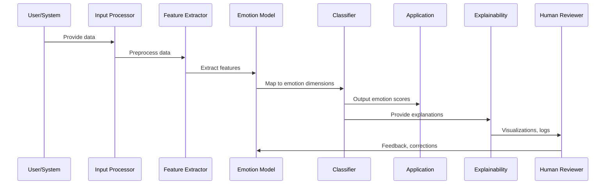
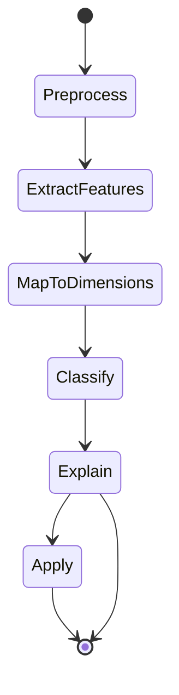
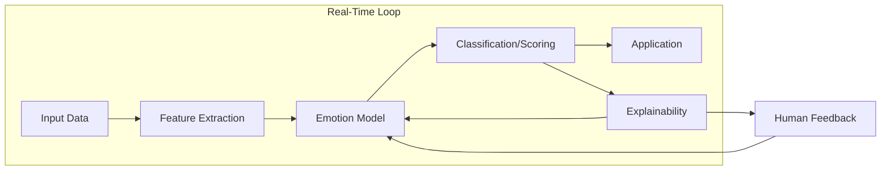

# Emotional Dimensionality Framework Architecture

## 1. High-Level Block Diagram

```mermaid
flowchart TD
    A[Input Data (Text/Signal)] --> B[Emotion Feature Extraction]
    B --> C[Dimensional Emotion Model]
    C --> D[Emotion Classification/Scoring]
    D --> E[Application Layer]
    C --> F[Explainability/Visualization]
    F --> G[Human Feedback]
    G --> C
```

**Explanation:**
- **Input Data:** Raw text, speech, or signals.
- **Emotion Feature Extraction:** Extracts relevant features (lexical, acoustic, etc.).
- **Dimensional Emotion Model:** Maps features to emotion dimensions (valence, arousal, etc.).
- **Emotion Classification/Scoring:** Produces emotion scores or categories.
- **Application Layer:** Uses emotion output for downstream tasks.
- **Explainability/Visualization:** Provides interpretable emotion breakdowns.
- **Human Feedback:** Enables correction and model refinement.

---

## 2. Detailed Data Flow Diagram



---

## 3. State Machine for Emotion Analysis



---

## 4. Real-Time Feedback Loop



---

## 5. Component Responsibilities Table

| Component                | Responsibilities                                               |
|--------------------------|---------------------------------------------------------------|
| Input Processor          | Preprocess and normalize input data                           |
| Feature Extractor        | Extract emotion-relevant features                             |
| Dimensional Emotion Model| Map features to emotion dimensions                            |
| Classifier/Scorer        | Produce emotion scores or categories                          |
| Application Layer        | Use emotion output for downstream tasks                       |
| Explainability           | Provide interpretable emotion breakdowns                      |
| Human Feedback           | Review, correct, and refine emotion models                    |

---

## 6. Notes on Synchronization

- The system supports real-time emotion analysis and feedback.
- Human feedback can be used to refine emotion models and explanations.
- All outputs are explainable and auditable.

---

**This architecture enables robust, interpretable, and adaptive emotion analysis for AI systems.**
