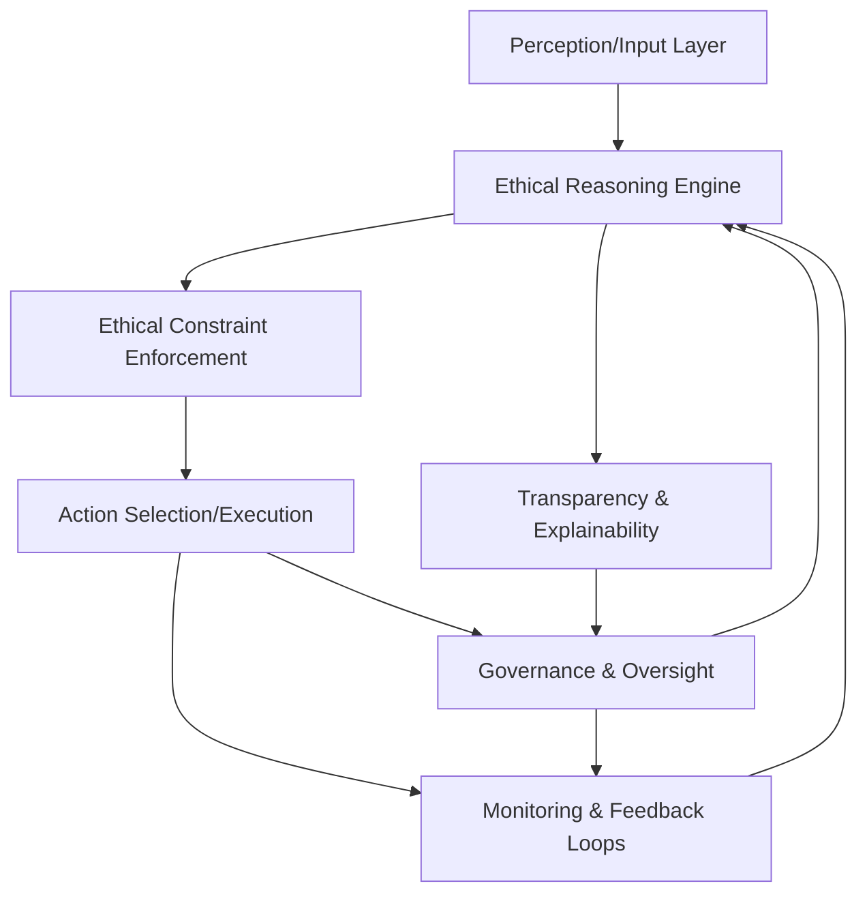
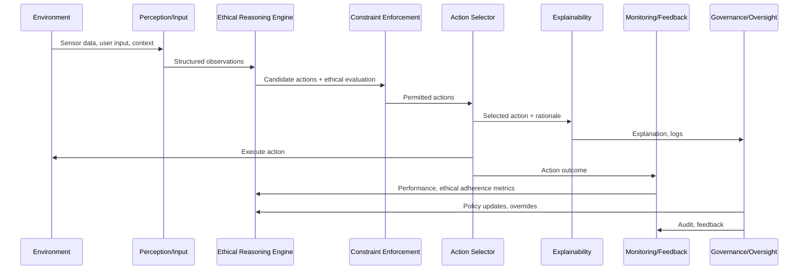
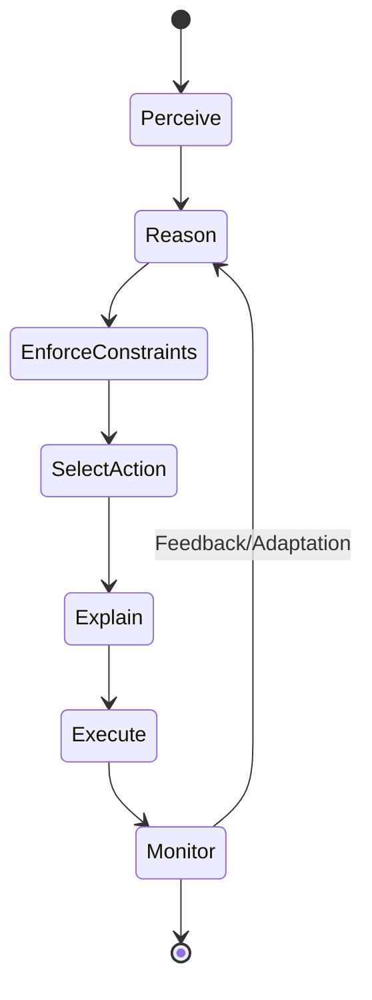
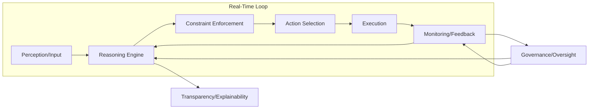

# COMPASS Framework: Architectural and Information Flow Diagrams

## 1. High-Level Block Diagram

**Explanation:**
- **Perception/Input Layer**: Receives environmental data, user commands, and system state.
- **Ethical Reasoning Engine**: Evaluates possible actions against the COMPASS directives.
- **Ethical Constraint Enforcement**: Filters out any actions violating hard constraints.
- **Action Selection/Execution**: Chooses and performs the best permissible action.
- **Transparency & Explainability**: Generates human-interpretable explanations for all decisions.
- **Monitoring & Feedback Loops**: Continuously tracks outcomes, system performance, and ethical adherence, feeding data back to the Reasoning Engine.
- **Governance & Oversight**: Human-in-the-loop review, audit, and override capabilities; can influence both reasoning and feedback.

---

## 2. Detailed Data Flow Diagram

---

## 3. State Machine for Action Evaluation

---

## 4. Real-Time Synchronization and Feedback Loop

---

## 5. Component Responsibilities Table

| Component                    | Responsibilities                                                                 |
|------------------------------|----------------------------------------------------------------------------------|
| Perception/Input              | Gather and preprocess all relevant data and context                              |
| Ethical Reasoning Engine      | Evaluate all possible actions against COMPASS directives                         |
| Ethical Constraint Enforcement| Block any action that violates non-negotiable ethical boundaries                 |
| Action Selection/Execution    | Select and execute the optimal action from the permitted set                     |
| Transparency & Explainability | Generate logs, rationales, and human-readable explanations for all decisions     |
| Monitoring & Feedback Loops   | Track outcomes, detect deviations, and provide data for continuous improvement   |
| Governance & Oversight        | Human review, policy updates, override, and audit of system behavior             |

---

## 6. Notes on Synchronization

- All components operate in a tightly coupled, real-time loop.
- Monitoring and Governance can trigger immediate adaptation or override at any stage.
- Transparency is maintained throughout, with every decision and action logged and explainable.
- Feedback from Monitoring and Governance is used to update reasoning policies and constraints dynamically.

---

**This architecture ensures that all parts of COMPASS work in harmony, supporting robust, auditable, and ethically aligned AI behavior.**
