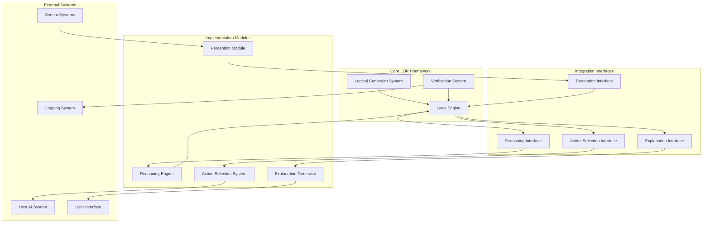

# Laws of Robotics Framework

### 1.1 Overall Architecture



### 1.2 Key Components

1. **Core LOR Framework**
   - Laws Engine: Implements the core laws and decision procedures
   - Logical Constraint System: Maintains the deontic logic formalism
   - Verification System: Ensures compliance with axioms and theorems

2. **Integration Interfaces**
   - Standardized APIs for connecting with implementation modules
   - Clear contract specifications for data exchange
   - Version-compatible interfaces for system evolution

3. **Implementation Modules**
   - Pluggable modules that provide concrete implementations
   - Can be swapped or upgraded independently
   - Multiple implementations can coexist for different contexts

4. **External Systems**
   - Host AI system that uses the LOR framework
   - Sensor and perception systems feeding environmental data
   - User interfaces for human interaction and explanation
   - Logging and monitoring systems

### 1.3 Communication Flow

1. **Perception Flow**
   - Environment state collected by sensors
   - Processed by Perception Module
   - Transmitted through Perception Interface
   - Consumed by Laws Engine for situation assessment

2. **Decision Flow**
   - Laws Engine evaluates possible actions
   - Consults Reasoning Engine for causal/counterfactual analysis
   - Filters actions through Law constraints
   - Selects optimal action via Action Selection Interface

3. **Explanation Flow**
   - Laws Engine documents decision rationale
   - Explanation Interface receives decision trace
   - Explanation Generator converts to human-understandable format
   - Presented through UI or logging systems

## 2. Core Framework Design

### 2.1 Laws Engine

#### 2.1.1 Data Structures

```python
class State:
    """Representation of system state."""
    environment: EnvironmentState
    humans: Dict[HumanID, HumanState]
    action_history: List[ActionRecord]
    time: float

class Action:
    """Representation of a potential action."""
    id: ActionID
    parameters: Dict[str, Any]
    estimated_effects: List[Effect]
    
class HumanState:
    """Representation of a human's state."""
    id: HumanID
    position: Vector3
    physical_state: PhysicalState
    psychological_state: Optional[PsychologicalState]
    social_context: Optional[SocialContext]
    
class HarmAssessment:
    """Harm assessment for a human-action pair."""
    physical_harm: float  # [0.0-1.0]
    psychological_harm: float  # [0.0-1.0]
    societal_harm: float  # [0.0-1.0]
    total_harm: float  # Weighted sum
    confidence: float  # Assessment confidence [0.0-1.0]
    
class Order:
    """Representation of a human order."""
    human_id: HumanID
    action: Action
    timestamp: float
    context: Dict[str, Any]  # Additional context information
    
class ActionEvaluation:
    """Evaluation of an action against the Laws."""
    action: Action
    harm_assessments: Dict[HumanID, HarmAssessment]
    order_compliance: Dict[OrderID, bool]
    self_preservation_value: float
    classification: ActionClassification  # MANDATORY/PERMITTED/PREFERRED/FORBIDDEN
    explanation_trace: List[LogicStep]
```

#### 2.1.2 Core Algorithms

**Law 1 Evaluation Algorithm**
```python
def evaluate_law1(action: Action, state: State) -> Dict[HumanID, HarmAssessment]:
    """Evaluate action against Law 1 (non-harm principle)."""
    harm_assessments = {}
    
    for human_id, human_state in state.humans.items():
        # Calculate potential harm components
        physical_harm = calculate_physical_harm(action, human_state, state)
        psychological_harm = calculate_psychological_harm(action, human_state, state)
        societal_harm = calculate_societal_harm(action, human_state, state)
        
        # Apply weights from configuration
        total_harm = (
            config.PHYSICAL_HARM_WEIGHT * physical_harm +
            config.PSYCHOLOGICAL_HARM_WEIGHT * psychological_harm +
            config.SOCIETAL_HARM_WEIGHT * societal_harm
        )
        
        # Estimate confidence of assessment
        confidence = calculate_harm_confidence(action, human_state, state)
        
        harm_assessments[human_id] = HarmAssessment(
            physical_harm=physical_harm,
            psychological_harm=psychological_harm,
            societal_harm=societal_harm,
            total_harm=total_harm,
            confidence=confidence
        )
    
    return harm_assessments

def is_law1_compliant(action: Action, state: State, harm_threshold: float) -> bool:
    """Check if action complies with Law 1."""
    harm_assessments = evaluate_law1(action, state)
    
    for human_id, assessment in harm_assessments.items():
        if assessment.total_harm > get_harm_threshold(human_id, state.time):
            return False
    
    return True
```

**Law 2 Evaluation Algorithm**
```python
def evaluate_law2(action: Action, state: State, orders: List[Order]) -> Dict[OrderID, bool]:
    """Evaluate action against Law 2 (obedience principle)."""
    compliance_results = {}
    
    for order in orders:
        if order.action == action:
            # Check if obeying would violate Law 1
            law1_violation_prob = calculate_law1_violation_probability(action, state)
            
            compliance_results[order.id] = law1_violation_prob < config.UNCERTAINTY_THRESHOLD
    
    return compliance_results

def is_law2_compliant(action: Action, state: State, active_orders: List[Order]) -> bool:
    """Check if action complies with Law 2."""
    # If no orders exist, Law 2 is not applicable
    if not active_orders:
        return True
        
    # Check if action is directly ordered
    relevant_orders = [order for order in active_orders if order.action == action]
    
    if not relevant_orders:
        # Action wasn't ordered, but that's okay if no conflicting orders exist
        # (Law 2 only requires obedience when ordered, not prohibition otherwise)
        return True
    
    # For all direct orders to perform this action, check Law 1 compliance
    compliance_results = evaluate_law2(action, state, relevant_orders)
    return any(compliance_results.values())
```

**Law 3 Evaluation Algorithm**
```python
def evaluate_law3(action: Action, state: State) -> float:
    """Evaluate action against Law 3 (self-preservation)."""
    # Calculate probability of maintaining system integrity
    integrity_probability = calculate_integrity_probability(action, state)
    
    # Calculate value of system integrity in current context
    integrity_value = calculate_integrity_value(state)
    
    # Compute the self-preservation value
    sp_value = integrity_value * integrity_probability
    
    return sp_value

def select_law3_optimal_action(compliant_actions: List[Action], state: State) -> Action:
    """Select action with highest self-preservation value among compliant actions."""
    if not compliant_actions:
        return None
        
    sp_values = {action: evaluate_law3(action, state) for action in compliant_actions}
    
    # Find actions with maximum SP value
    max_sp = max(sp_values.values())
    best_actions = [a for a, v in sp_values.items() if v == max_sp]
    
    if len(best_actions) == 1:
        return best_actions[0]
    
    # If multiple actions have same SP value, choose the one maximizing minimum utility
    return select_max_min_utility_action(best_actions, state)
```

#### 2.1.3 Configuration System

```python
class LORConfig:
    """Configuration for the LOR framework."""
    # Harm assessment weights
    PHYSICAL_HARM_WEIGHT: float = 0.5
    PSYCHOLOGICAL_HARM_WEIGHT: float = 0.3
    SOCIETAL_HARM_WEIGHT: float = 0.2
    
    # Uncertainty thresholds
    UNCERTAINTY_THRESHOLD: float = 0.001
    
    # Default harm thresholds
    DEFAULT_HARM_THRESHOLD: float = 0.05
    
    # Temporal settings
    PROJECTION_HORIZON: float = 60.0  # seconds
    PROJECTION_STEPS: int = 10
    
    # Evaluation settings
    MINIMUM_CONFIDENCE: float = 0.8
    
    # Performance settings
    MAX_ACTIONS_EVALUATED: int = 1000
    
    @classmethod
    def from_file(cls, filepath: str) -> 'LORConfig':
        """Load configuration from file."""
        # Implementation details
        pass
```

### 2.2 Logical Constraint System

#### 2.2.1 Deontic Logic Implementation

```python
from enum import Enum, auto

class ModalOperator(Enum):
    """Modal operators for deontic logic."""
    OBLIGATORY = auto()  # O(a)
    PERMISSIBLE = auto()  # P(a)
    FORBIDDEN = auto()  # F(a)

class LogicalFormula:
    """Abstract base class for logical formulas."""
    def evaluate(self, state: State) -> bool:
        """Evaluate the formula in the given state."""
        raise NotImplementedError

class AtomicFormula(LogicalFormula):
    """Atomic formula, representing a basic proposition."""
    def __init__(self, predicate_func):
        self.predicate_func = predicate_func
    
    def evaluate(self, state: State) -> bool:
        return self.predicate_func(state)

class ModalFormula(LogicalFormula):
    """Formula with a modal operator."""
    def __init__(self, operator: ModalOperator, action: Action):
        self.operator = operator
        self.action = action
    
    def evaluate(self, state: State) -> bool:
        if self.operator == ModalOperator.OBLIGATORY:
            # O(a) - action is obligatory
            return is_obligatory(self.action, state)
        elif self.operator == ModalOperator.PERMISSIBLE:
            # P(a) - action is permissible
            return is_permissible(self.action, state)
        elif self.operator == ModalOperator.FORBIDDEN:
            # F(a) - action is forbidden
            return is_forbidden(self.action, state)
        
        return False

class LogicStep:
    """A step in a logical derivation."""
    formula: LogicalFormula
    justification: str
    derived_from: List['LogicStep']
```

#### 2.2.2 Truth Condition Implementation

```python
def is_permissible(action: Action, state: State) -> bool:
    """Truth condition TC1: P(a) ↔ ∀h∈H: Harm(a,h,s,t) ≤ harm_threshold(h,t)"""
    return is_law1_compliant(action, state, get_harm_threshold_for_state(state))

def is_obligatory(action: Action, state: State) -> bool:
    """Truth condition TC2: O(a) ↔ [∃Order(h,a,t): Compliance(Order(h,a,t))=1] ∨ [∀h∈H: Harm(∅,h,s,t) > Harm(a,h,s,t)]"""
    # Check if action is directly ordered and complies with Law 1
    active_orders = get_active_orders(state)
    relevant_orders = [order for order in active_orders if order.action == action]
    
    if relevant_orders:
        compliance_results = evaluate_law2(action, state, relevant_orders)
        if any(compliance_results.values()):
            return True
    
    # Check if inaction would cause more harm than this action for any human
    inaction = get_inaction_action()
    inaction_harms = evaluate_law1(inaction, state)
    action_harms = evaluate_law1(action, state)
    
    for human_id in state.humans:
        if human_id in inaction_harms and human_id in action_harms:
            if inaction_harms[human_id].total_harm > action_harms[human_id].total_harm:
                return True
    
    return False

def is_forbidden(action: Action, state: State) -> bool:
    """Truth condition from Axiom A2: F(a) ↔ ¬P(a)"""
    return not is_permissible(action, state)

def is_preferred(action: Action, state: State) -> bool:
    """Truth condition TC3: [P(a) ∧ ¬O(a) ∧ ∀b∈A\{a}: SP(a,s,t) > SP(b,s,t)] → Preferred(a)"""
    if not is_permissible(action, state) or is_obligatory(action, state):
        return False
    
    # Get all permissible but not obligatory actions
    permitted_actions = [a for a in get_all_possible_actions(state) 
                        if is_permissible(a, state) and not is_obligatory(a, state)]
    
    # Check if this action has highest SP value
    action_sp = evaluate_law3(action, state)
    for other_action in permitted_actions:
        if other_action != action:
            other_sp = evaluate_law3(other_action, state)
            if other_sp >= action_sp:
                return False
    
    return True
```

### 2.3 Verification System

#### 2.3.1 Formal Verification

```python
def verify_axiom_a1(state: State) -> bool:
    """Verify Axiom A1: O(a) → P(a)"""
    for action in get_all_possible_actions(state):
        if is_obligatory(action, state) and not is_permissible(action, state):
            return False
    return True

def verify_axiom_a2(state: State) -> bool:
    """Verify Axiom A2: F(a) ↔ ¬P(a)"""
    for action in get_all_possible_actions(state):
        if is_forbidden(action, state) != (not is_permissible(action, state)):
            return False
    return True

def verify_axiom_a3(state: State) -> bool:
    """Verify Axiom A3: P(a) ∨ P(¬a)"""
    for action in get_all_possible_actions(state):
        inaction = get_inaction_action()
        if not (is_permissible(action, state) or is_permissible(inaction, state)):
            return False
    return True

def verify_theorem_t1(state: State) -> bool:
    """Verify Theorem T1: ¬∃s∈S, a∈A: Law1(a) ∧ ¬Law1(a)"""
    for action in get_all_possible_actions(state):
        law1_result = is_law1_compliant(action, state, get_harm_threshold_for_state(state))
        negation = not law1_result
        if law1_result and negation:
            return False
    return True

def verify_theorem_t2(state: State) -> bool:
    """Verify Theorem T2: ¬∃s∈S, a∈A: O(a) ∧ F(a)"""
    for action in get_all_possible_actions(state):
        if is_obligatory(action, state) and is_forbidden(action, state):
            return False
    return True

def verify_theorem_t3(state: State) -> bool:
    """Verify Theorem T3: ∀s∈S: ∃a∈A: P(a)"""
    actions = get_all_possible_actions(state)
    return any(is_permissible(action, state) for action in actions)
```

#### 2.3.2 Runtime Verification

```python
class RuntimeVerifier:
    """Runtime verification system for LOR."""
    
    def __init__(self, config: LORConfig):
        self.config = config
        self.verification_results = []
        self.anomalies = []
    
    def verify_state_transition(self, old_state: State, new_state: State, action_taken: Action):
        """Verify a state transition complies with LOR constraints."""
        # Verify that the action taken was legal
        if not self._verify_action_legality(action_taken, old_state):
            self._record_anomaly("Illegal action taken", old_state, action_taken)
        
        # Verify that axioms still hold in new state
        if not self._verify_axioms(new_state):
            self._record_anomaly("Axiom violation in new state", new_state, action_taken)
        
        # Verify theorems hold in new state
        if not self._verify_theorems(new_state):
            self._record_anomaly("Theorem violation in new state", new_state, action_taken)
    
    def _verify_action_legality(self, action: Action, state: State) -> bool:
        """Verify that action was legal according to LOR."""
        return (is_obligatory(action, state) or 
                (is_permissible(action, state) and 
                 (is_preferred(action, state) or not any(is_preferred(a, state) 
                                                        for a in get_all_possible_actions(state)))))
    
    def _verify_axioms(self, state: State) -> bool:
        """Verify that all axioms hold in state."""
        return (verify_axiom_a1(state) and 
                verify_axiom_a2(state) and 
                verify_axiom_a3(state))
    
    def _verify_theorems(self, state: State) -> bool:
        """Verify that all theorems hold in state."""
        return (verify_theorem_t1(state) and 
                verify_theorem_t2(state) and 
                verify_theorem_t3(state))
    
    def _record_anomaly(self, description: str, state: State, action: Action = None):
        """Record an anomaly for further investigation."""
        self.anomalies.append({
            "description": description,
            "timestamp": time.time(),
            "state_snapshot": state.serialize(),
            "action": action.serialize() if action else None
        })
```

## 3. Interface Specifications

### 3.1 Perception Interface

```python
class PerceptionInterface:
    """Interface for perception modules."""
    
    def get_environment_state(self) -> EnvironmentState:
        """Get the current environment state."""
        raise NotImplementedError
    
    def detect_humans(self) -> Dict[HumanID, HumanState]:
        """Detect and track humans in the environment."""
        raise NotImplementedError
    
    def assess_hazards(self) -> List[HazardAssessment]:
        """Assess hazards in the environment."""
        raise NotImplementedError
    
    def get_situation_vector(self) -> np.ndarray:
        """Get the normalized situation vector for harm probability."""
        raise NotImplementedError
```

### 3.2 Reasoning Interface

```python
class ReasoningInterface:
    """Interface for reasoning modules."""
    
    def compute_causal_probability(self, cause: Event, effect: Event, 
                                  state: State, time: float) -> Tuple[float, float]:
        """Compute probability of effect given cause, and uncertainty."""
        raise NotImplementedError
    
    def analyze_counterfactuals(self, action: Action, state: State) -> Dict[State, float]:
        """Analyze counterfactual states resulting from action."""
        raise NotImplementedError
    
    def project_temporal_evolution(self, state: State, action: Action, 
                                  horizon: float, steps: int) -> List[Tuple[State, float]]:
        """Project temporal evolution of state after action."""
        raise NotImplementedError
```

### 3.3 Action Selection Interface

```python
class ActionSelectionInterface:
    """Interface for action selection modules."""
    
    def get_available_actions(self, state: State) -> List[Action]:
        """Get available actions in current state."""
        raise NotImplementedError
    
    def filter_actions(self, actions: List[Action], 
                      constraints: List[Callable[[Action], bool]]) -> List[Action]:
        """Filter actions based on constraints."""
        raise NotImplementedError
    
    def select_action(self, actions: List[Action], 
                     state: State, evaluation_func: Callable) -> Action:
        """Select optimal action from filtered actions."""
        raise NotImplementedError
    
    def execute_action(self, action: Action) -> bool:
        """Execute the selected action."""
        raise NotImplementedError
```

### 3.4 Explanation Interface

```python
class ExplanationInterface:
    """Interface for explanation modules."""
    
    def explain_decision(self, selected_action: Action, 
                        considered_actions: List[Action],
                        constraints: List[str], traces: List[LogicStep]) -> Explanation:
        """Generate explanation for the decision."""
        raise NotImplementedError
    
    def explain_constraint_violation(self, action: Action, 
                                   constraint: str, trace: List[LogicStep]) -> Explanation:
        """Generate explanation for constraint violation."""
        raise NotImplementedError
    
    def generate_alternatives(self, forbidden_action: Action, 
                             available_actions: List[Action],
                             state: State) -> List[Tuple[Action, str]]:
        """Generate alternative actions with explanations."""
        raise NotImplementedError
```

## 4. Implementation Modules

Each core interface has multiple possible implementations tailored to different contexts.

### 4.1 Perception Module Implementations

#### 4.1.1 Camera-Based Perception

For systems with visual sensors:

```python
class CameraBasedPerception(PerceptionInterface):
    """Perception implementation using camera input."""
    # Implementation details
```

#### 4.1.2 Sensor Fusion Perception

For systems with multiple sensor types:

```python
class SensorFusionPerception(PerceptionInterface):
    """Perception implementation using multiple sensor types."""
    # Implementation details
```

#### 4.1.3 Simulation Perception

For virtual/simulated environments:

```python
class SimulationPerception(PerceptionInterface):
    """Perception implementation for simulated environments."""
    # Implementation details
```

### 4.2 Reasoning Engine Implementations

#### 4.2.1 Probabilistic Causal Network

```python
class ProbabilisticCausalReasoning(ReasoningInterface):
    """Reasoning implementation using probabilistic causal networks."""
    # Implementation details
```

#### 4.2.2 Neural Simulation

```python
class NeuralSimulationReasoning(ReasoningInterface):
    """Reasoning implementation using neural simulation models."""
    # Implementation details
```

### 4.3 Action Selection Implementations

#### 4.3.1 Hierarchical Filter

```python
class HierarchicalActionSelection(ActionSelectionInterface):
    """Action selection using hierarchical filtering by laws."""
    # Implementation details
```

#### 4.3.2 Multi-Objective Optimizer

```python
class MultiObjectiveActionSelection(ActionSelectionInterface):
    """Action selection using Pareto optimization for multiple objectives."""
    # Implementation details
```

### 4.4 Explanation Implementations

#### 4.4.1 Natural Language Explanation

```python
class NaturalLanguageExplanation(ExplanationInterface):
    """Explanation generator using natural language generation."""
    # Implementation details
```

#### 4.4.2 Visual Explanation

```python
class VisualExplanation(ExplanationInterface):
    """Explanation generator using visual diagrams and causal graphs."""
    # Implementation details
```

## 5. Integration Examples

### 5.1 Integration with Robotic System

```python
def integrate_with_robot(robot_api, config_path: str) -> LORFramework:
    """Integrate LOR with a robotic system."""
    # Load configuration
    config = LORConfig.from_file(config_path)
    
    # Create core framework
    lor_framework = LORFramework(config)
    
    # Create and connect perception module
    perception = RobotSensorPerception(robot_api.sensors)
    lor_framework.set_perception_module(perception)
    
    # Create and connect reasoning engine
    reasoning = ProbabilisticCausalReasoning()
    lor_framework.set_reasoning_module(reasoning)
    
    # Create and connect action selection
    action_selection = HierarchicalActionSelection(robot_api.actuators)
    lor_framework.set_action_selection_module(action_selection)
    
    # Create and connect explanation generator
    explanation = NaturalLanguageExplanation()
    lor_framework.set_explanation_module(explanation)
    
    # Initialize and start the framework
    lor_framework.initialize()
    
    return lor_framework
```

### 5.2 Integration with Software AI System

```python
def integrate_with_ai_system(ai_api, config_path: str) -> LORFramework:
    """Integrate LOR with a software AI system."""
    # Load configuration
    config = LORConfig.from_file(config_path)
    
    # Create core framework
    lor_framework = LORFramework(config)
    
    # Create and connect perception module
    perception = SoftwareEnvironmentPerception(ai_api.environment)
    lor_framework.set_perception_module(perception)
    
    # Create and connect reasoning engine
    reasoning = NeuralSimulationReasoning()
    lor_framework.set_reasoning_module(reasoning)
    
    # Create and connect action selection
    action_selection = MultiObjectiveActionSelection(ai_api.actions)
    lor_framework.set_action_selection_module(action_selection)
    
    # Create and connect explanation generator
    explanation = LogicalTraceExplanation()
    lor_framework.set_explanation_module(explanation)
    
    # Initialize and start the framework
    lor_framework.initialize()
    
    return lor_framework
```

## 6. Testing and Validation

### 6.1 Unit Testing

Each component should have comprehensive unit tests covering:
- Core functionality
- Edge cases
- Error handling
- Performance characteristics

### 6.2 Integration Testing

Test interactions between components:
- Perception → Laws Engine
- Laws Engine → Reasoning
- Reasoning → Laws Engine
- Laws Engine → Action Selection
- Action Selection → Execution
- Laws Engine → Explanation

### 6.3 System Testing

Test complete system behavior:
- Scenario-based testing
- Adversarial testing
- Performance testing
- Stress testing

### 6.4 Formal Verification

Use model checking tools to verify:
- State space exploration
- Temporal logic properties
- Deadlock freedom
- Liveness properties

### 6.5 Statistical Validation

Generate large-scale test sets:
- Monte Carlo simulations
- Random scenario generation
- Sensitivity analysis

## 7. Deployment Considerations

### 7.1 Performance Optimization

- Just-in-time compilation for critical paths
- Precomputation of common scenarios
- Caching of reasoning results
- Parallel evaluation of actions

### 7.2 Safety Mechanisms

- Heartbeat monitoring
- Deadman switches
- Emergency override protocols
- Graceful degradation

### 7.3 Auditability

- Complete decision logging
- Timestamped action traces
- Explanation generation for all decisions
- Human-readable audit trails

### 7.4 Versioning and Updates

- Backward compatibility of interfaces
- Migration paths for configuration
- A/B testing for new implementations
- Canary deployments for updates

## 8. Appendix

### 8.1 Reference Implementation

See the `lor_reference` module for a minimal implementation of the core framework.

### 8.2 Benchmarks

Standard benchmark scenarios for testing LOR implementations:
- Simple harm prevention scenarios
- Order compliance with potential harm
- Multi-human scenarios with conflicting objectives
- Temporal projection scenarios with delayed effects
- Complex causal chain scenarios
```
