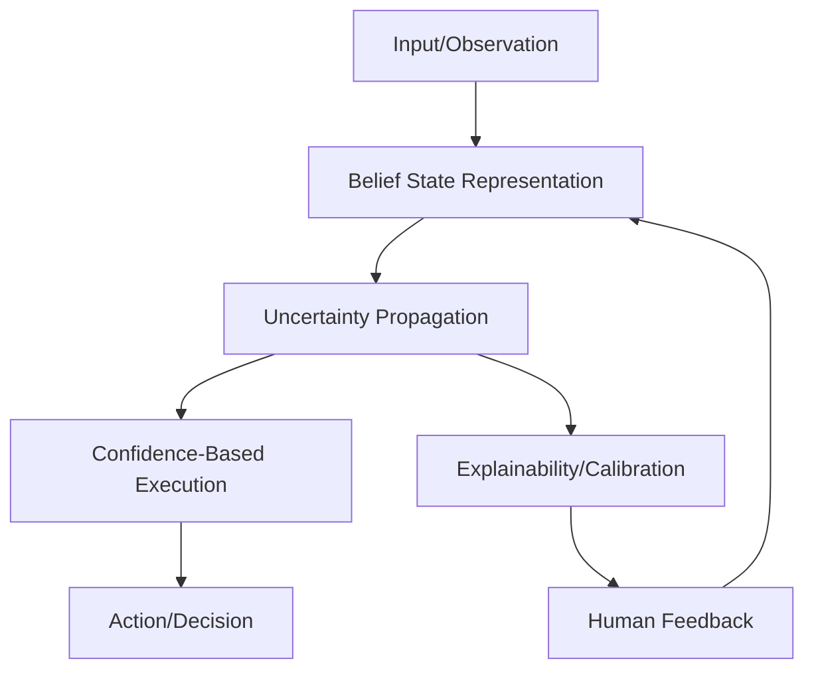
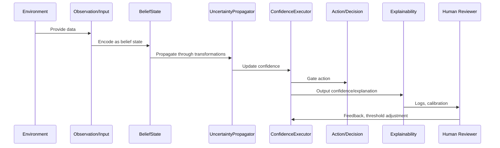
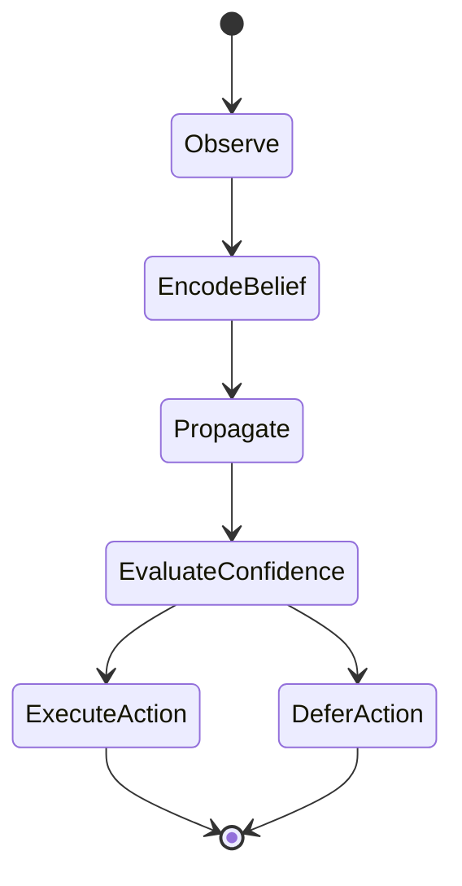
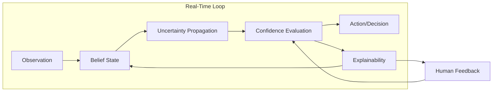

# Probabilistic Uncertainty Principle (PUP) Framework Architecture

## 1. High-Level Block Diagram

**Explanation:**
- **Input/Observation:** Raw data or system state.
- **Belief State Representation:** Encodes mean, variance, and confidence.
- **Uncertainty Propagation:** Updates beliefs through transformations.
- **Confidence-Based Execution:** Gates actions based on confidence thresholds.
- **Action/Decision:** Executes or defers actions.
- **Explainability/Calibration:** Provides confidence/explanation outputs.
- **Human Feedback:** Refines thresholds and calibration.

---

## 2. Detailed Data Flow Diagram

---

## 3. State Machine for Uncertainty-Aware Execution

---

## 4. Real-Time Feedback Loop

---

## 5. Component Responsibilities Table

| Component                | Responsibilities                                               |
|--------------------------|---------------------------------------------------------------|
| Observation/Input        | Gather and preprocess data                                    |
| Belief State             | Represent probabilistic knowledge and uncertainty             |
| Uncertainty Propagator   | Update beliefs through transformations                        |
| Confidence Executor      | Gate actions based on confidence thresholds                   |
| Action/Decision          | Execute or defer actions                                      |
| Explainability/Calibration | Provide confidence, logs, and calibration tools             |
| Human Feedback           | Adjust thresholds, review calibration                         |

---

## 6. Notes on Synchronization

- All components operate in a real-time, uncertainty-aware loop.
- Human feedback is used for calibration and threshold adjustment.
- All decisions are explainable and confidence-annotated.

---

**This architecture ensures robust, calibrated, and transparent uncertainty handling in AI systems.**
