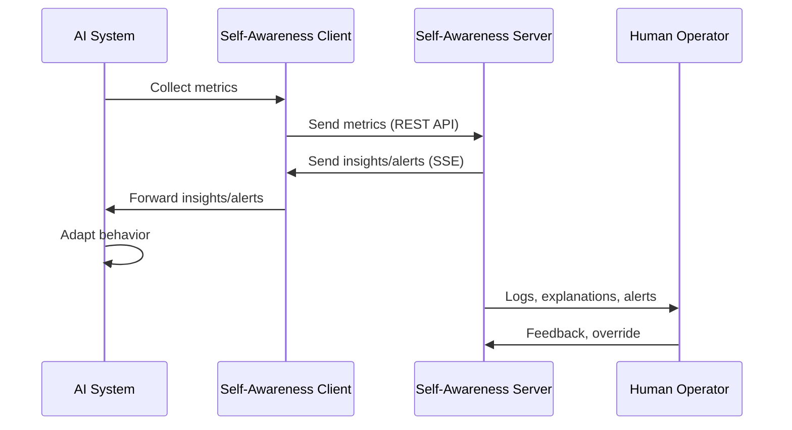
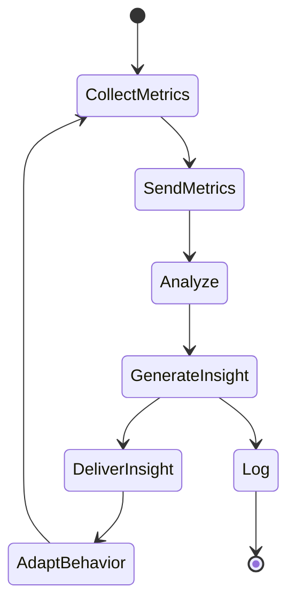
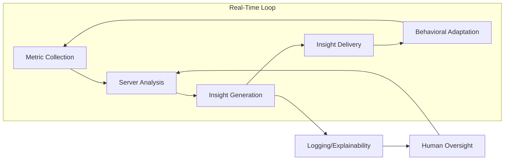

# Self-Awareness Framework Architecture

## 1. High-Level Block Diagram

```mermaid
flowchart TD
    A[Metric Collection (Client)] --> B[Self-Awareness Server]
    B --> C[Insight Generation]
    C --> D[Insight/Alert Delivery]
    D --> E[Behavioral Adaptation (Client)]
    E --> A
    C --> F[Logging & Explainability]
    F --> G[Human Oversight]
    G --> B
```

**Explanation:**
- **Metric Collection (Client):** Gathers system metrics and sends to server.
- **Self-Awareness Server:** Central analysis and coordination.
- **Insight Generation:** Analyzes metrics, detects patterns/anomalies.
- **Insight/Alert Delivery:** Sends actionable insights/alerts to client.
- **Behavioral Adaptation (Client):** Client adapts behavior based on insights.
- **Logging & Explainability:** All insights/actions are logged and explainable.
- **Human Oversight:** Allows for audit, override, and feedback.

---

## 2. Detailed Data Flow Diagram



---

## 3. State Machine for Self-Awareness Cycle



---

## 4. Real-Time Synchronization and Feedback Loop



---

## 5. Component Responsibilities Table

| Component              | Responsibilities                                                        |
|------------------------|-------------------------------------------------------------------------|
| Metric Collection      | Gather and send system metrics                                          |
| Self-Awareness Server  | Aggregate, analyze, and coordinate insights                             |
| Insight Generation     | Detect anomalies, generate insights/alerts                              |
| Insight Delivery       | Communicate insights/alerts to client                                   |
| Behavioral Adaptation  | Adjust AI behavior based on received insights                           |
| Logging & Explainability | Record all actions, provide explanations for insights and adaptations |
| Human Oversight        | Audit, override, and provide feedback to the system                     |

---

## 6. Notes on Synchronization

- The client and server operate in a continuous, real-time feedback loop.
- Human oversight can intervene at any stage for audit or override.
- All insights and adaptations are logged and explainable.

---

**This architecture ensures robust, adaptive, and transparent self-awareness for AI systems.**
