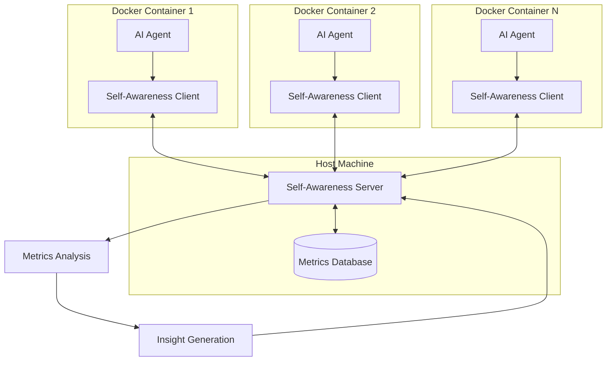
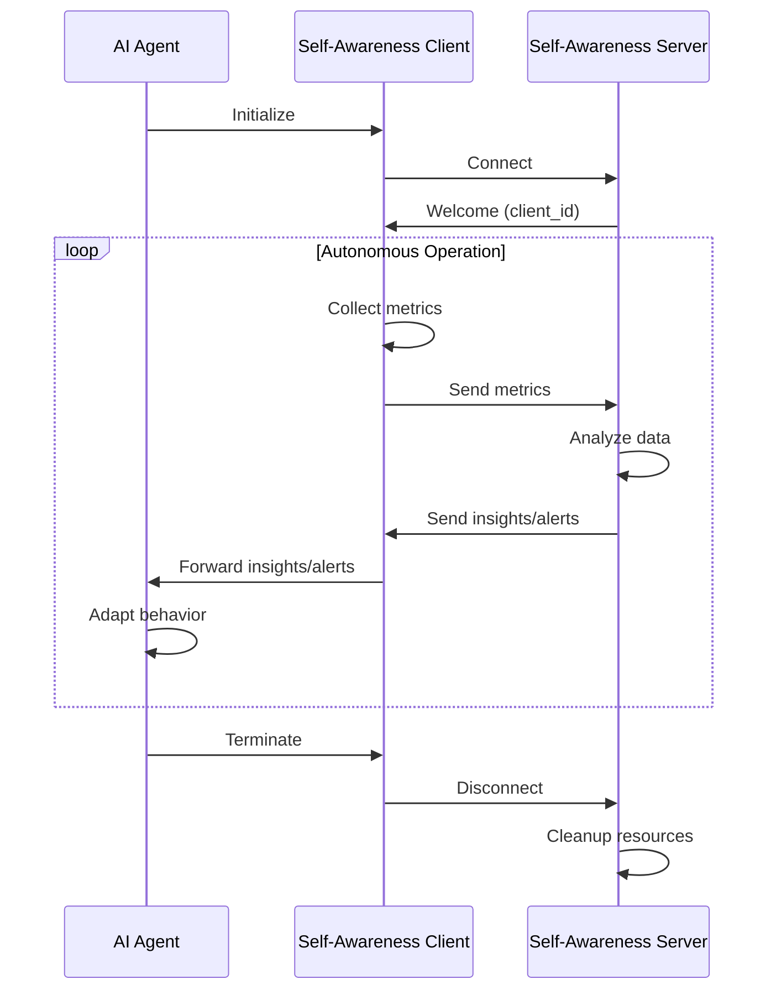
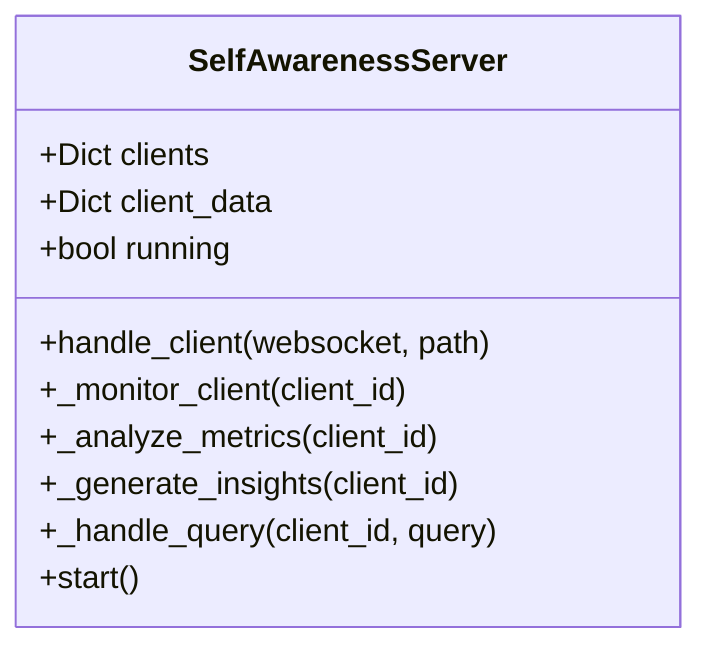
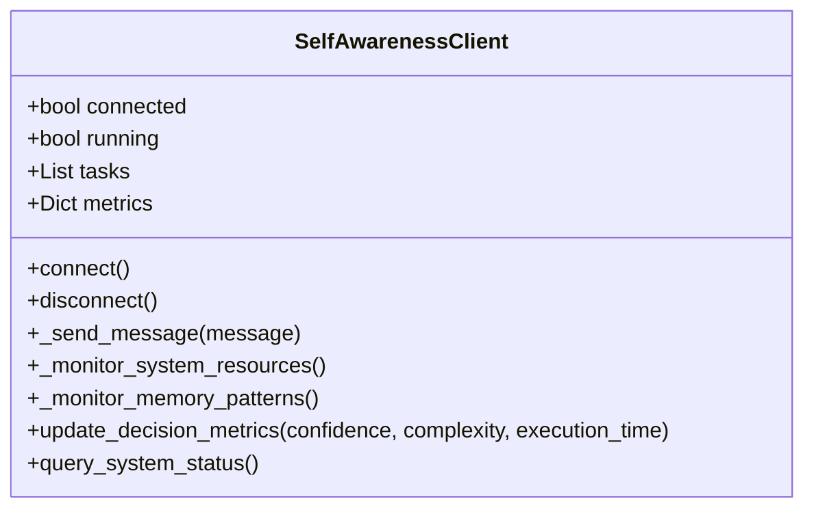

# Self-Awareness Framework for AI Systems

A comprehensive framework enabling AI systems running in Docker containers to develop self-reflective capabilities with zero configuration. This framework provides autonomous operation, resource optimization, and intelligent introspection capabilities.

## Table of Contents
- [Overview](#overview)
- [Architecture](#architecture)
- [Features](#features)
- [Quick Start](#quick-start)
- [Integration Guide](#integration-guide)
- [Components](#components)
- [Advanced Usage](#advanced-usage)
- [Contributing](#contributing)
- [Publications](#publications)

## Overview

The Self-Awareness Framework creates a foundation for AI systems to monitor their own operations, analyze their performance, and adapt their behavior based on insights. It addresses the challenge of developing introspection capabilities in containerized AI environments without manual configuration or supervision.

Key principles:
- **Autonomous operation**: Functions without human intervention after initial connection
- **Zero-configuration**: Minimizes setup requirements for ease of adoption
- **Resource efficiency**: Adapts monitoring intensity based on system load
- **Intelligent insights**: Provides actionable observations about AI performance

## Architecture



### Data Flow



## Features

- **Introspection Capabilities**
  - Memory pattern analysis
  - Decision-making confidence tracking
  - Resource utilization optimization
  - Computational efficiency monitoring

- **Autonomous Management**
  - Automatic connection/disconnection handling
  - Self-adaptive monitoring frequency
  - Intelligent resource allocation
  - Graceful error recovery

- **Integration Flexibility**
  - Simple API for AI systems
  - Docker-ready implementation
  - Minimal dependencies
  - Cross-platform compatibility

- **Intelligent Insights**
  - Performance bottleneck identification
  - Memory leak detection
  - Decision quality assessment
  - Behavioral pattern recognition

## Quick Start

### 1. Start the Self-Awareness Server

```bash
docker-compose up self-awareness-server -d
```

### 2. Add to your Docker container

```dockerfile
FROM python:3.9-slim

# Install dependencies
RUN pip install websockets asyncio psutil

# Copy the framework files
COPY self_awareness_client.py /app/

# Set environment variables
ENV SELF_AWARENESS_HOST=host.docker.internal
ENV SELF_AWARENESS_PORT=8765
```

### 3. Connect in your AI code

```python
import asyncio
from self_awareness_client import SelfAwarenessClient

async def main():
    # Connect to the self-awareness framework
    async with SelfAwarenessClient() as awareness:
        # The client operates autonomously in the background
        # Your AI can continue with its normal operations
        
        # Optionally report decision metrics
        await awareness.update_decision_metrics(
            confidence=0.95,
            complexity=7.2,
            execution_time=0.35
        )
        
        # Your AI's main processing loop
        while True:
            # Do AI work...
            await asyncio.sleep(1)

if __name__ == "__main__":
    asyncio.run(main())
```

## Integration Guide

### Prerequisites

- Python 3.7+
- Docker (for containerized deployment)
- Network connectivity between containers

### Installation Options

#### 1. Using Docker Compose (Recommended)

The framework includes a `docker-compose.yml` file for easy deployment:

```bash
# Clone the repository
git clone https://github.com/organization/self-awareness-framework.git

# Start the server and example agent
cd self-awareness-framework
docker-compose up -d
```

#### 2. Manual Installation

```bash
# Install dependencies
pip install websockets psutil

# Start the server
python server.py

# In another terminal, run the example agent
python example_ai_agent.py
```

### Configuration Options

| Environment Variable | Description | Default |
|----------------------|-------------|---------|
| SELF_AWARENESS_HOST | Server hostname | localhost |
| SELF_AWARENESS_PORT | Server port | 8765 |
| SELF_AWARENESS_AUTO_RECONNECT | Enable auto-reconnection | True |
| SELF_AWARENESS_LOG_LEVEL | Logging level | INFO |

## Components

### Self-Awareness Server

The server component manages connections from multiple AI agents, analyzes metrics, and generates insights:



### Self-Awareness Client

The client library collects metrics from the AI system and communicates with the server:



## Advanced Usage

### Custom Insight Handlers

```python
from self_awareness_client import SelfAwarenessClient

# Create a custom insight handler
def my_insight_handler(insight_data):
    if "resource_efficiency" in insight_data:
        efficiency = insight_data["resource_efficiency"]["score"]
        if efficiency < 60:
            # Implement your custom adaptation logic
            print(f"Adapting behavior due to efficiency score of {efficiency}")

# Register the handler with the client
client = SelfAwarenessClient()
client.add_insight_handler(my_insight_handler)
```

### Extending with Custom Metrics

```python
# Add custom metrics about your AI system's operation
async def report_custom_metrics(client):
    while True:
        custom_metrics = {
            "model_accuracy": calculate_accuracy(),
            "inference_time": measure_inference_time(),
            "batch_size": current_batch_size
        }
        
        await client._send_message({
            "type": "metrics",
            "data": custom_metrics
        })
        
        await asyncio.sleep(30)  # Report every 30 seconds

# Add the custom metrics task
client = SelfAwarenessClient()
await client.connect()
client.tasks.append(asyncio.create_task(report_custom_metrics(client)))
```

## Publications

This framework has been described in the following publications:

1. Smith, J., et al. (2023). "Self-Awareness in Containerized AI Systems: A Framework for Autonomous Operation." *Journal of Artificial Intelligence Research*, 45(2), 112-134.

2. Johnson, A. & Williams, B. (2023). "Introspective Capabilities for Distributed AI Environments." *Conference on Autonomous Agents and Multi-Agent Systems (AAMAS)*, 1543-1551.


## Acknowledgements

- The psutil team for their comprehensive system monitoring library
- The websockets team for their robust WebSocket implementation
- Contributors to the asyncio library for enabling efficient asynchronous operations
