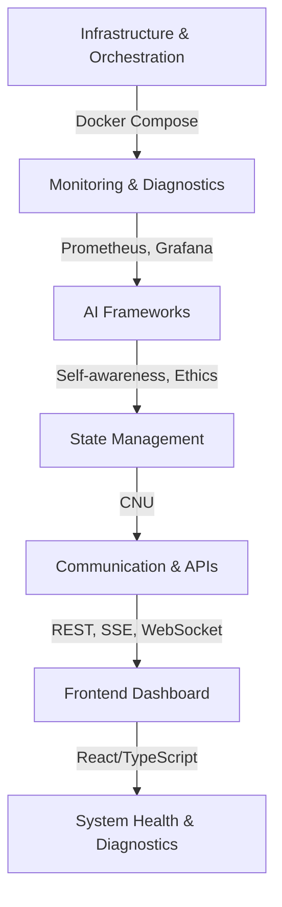

# System Report

## 1. System Overview

Your workspace is a modular AI research environment designed for advanced experimentation, monitoring, and self-improvement. It features:

- **Multi-container orchestration**: Docker, Docker Compose
- **Advanced monitoring**: Prometheus, Grafana, Node Exporter, cAdvisor
- **AI frameworks**: Self-awareness, ethics (COMPASS), emotional dimensionality, and cognitive simulation
- **Centralized state management**: CNU (Core Neurological State Manager)
- **Unified diagnostics and error handling**: Python, JS, Bash
- **Frontend dashboard**: React/TypeScript for real-time environment monitoring
- **APIs**: REST, SSE, and WebSocket for data and control flows
- **Extensive documentation**: Architecture, protocols, and implementation checklists

---

## 2. Key Layers & Components

### A. Infrastructure & Orchestration
- **Docker Compose**: Orchestrates containers for monitoring, AI frameworks, and supporting services.
- **Node Exporter & cAdvisor**: Collects system/container metrics for Prometheus.

### B. Monitoring & Diagnostics
- **Prometheus**: Scrapes metrics from containers and system endpoints.
- **Grafana**: Visualizes metrics (CPU, memory, disk, GPU, network, ML metrics).
- **Python Diagnostics**: `diagnostics.py` provides system sweeps, resource checks, and issue detection.
- **Error Handling**: Multi-layered (Bash, Python, JS), with logging, retries, and recovery.

### C. AI Frameworks
- **Self-Awareness Mechanics**: Tracks system introspection, capabilities, epistemic/temporal/social awareness.
- **COMPASS (Ethics)**: Provides ethical reasoning, governance, and API endpoints.
- **Emotional Dimensionality**: Models and tracks system "emotional" states for adaptive control.
- **Cognitive Simulation**: For advanced reasoning and analytics.

### D. State Management
- **CNU (Core Neurological State Manager)**: Central memory and query engine for all frameworks, logs, and analytics. Integrates with Web3/NFT for memory persistence.

### E. Communication & APIs
- **REST, SSE, WebSocket**: Standardized via `dataService` abstraction. Protocols mapped per feature/module.
- **MCP (Context Protocol)**: Unified context/session management, model provider abstraction, and system info endpoints.

### F. Frontend
- **React/TypeScript Dashboard**: Real-time environment monitoring, metrics visualization, and alerting.
- **Hooks & Services**: `useEnvironmentMonitoring`, `monitoringService` abstract protocol and data fetching.

---

## 3. System Health & Diagnostics

### A. Automated Health Checks
- **Health endpoints**: `/api/v1/health`, `/metrics` (Prometheus), `/api/monitoring/performance`
- **Diagnostic scripts**: Python modules for full system sweeps, resource checks, and reporting.
- **Frontend**: Displays health, metrics, and alerts for each container/environment.

### B. Resource Monitoring
- **Metrics tracked**: CPU, Memory, Disk, Network, GPU (per container and system-wide).
- **Docker/Container Awareness**: Detects container limits, environment, and recommends resource flags.
- **Alerting**: Warnings for high memory/disk usage, missing Docker, or degraded health.

### C. Error Handling
- **Automatic retries**: For transient errors.
- **Graceful degradation**: Fallback strategies.
- **Centralized logging**: (Winston, Python logging).
- **Error taxonomy**: System, operational, application errors classified and logged.

### D. Optimization & Recommendations
- **SystemManager**: Calculates optimal CPU/memory, recommends Docker flags, and environment variables.
- **Runtime optimization scripts**: Adjust swappiness, clear caches, and initialize frameworks as needed.

---

## 4. Protocols & Integration
- All communication is standardized via the `dataService` abstraction.
- **REST**: For most data.
- **SSE**: For real-time updates.
- **WebSocket**: For select features.
- Backend endpoints are verified and documented for health, metrics, and context management.
- Frontend hooks select protocol based on feature and configuration.

---

## 5. Documentation & Checklists
- Comprehensive documentation for architecture, protocols, monitoring, and troubleshooting.
- Checklists ensure all features, optimizations, and integrations are tracked and completed.
- Research papers and design docs outline self-improvement, metacognition, and deployment strategies.

---

## 6. Current Status & Recommendations

### Current Status
- All major frameworks and monitoring are implemented and integrated.
- Diagnostics and error handling are robust and multi-layered.
- Documentation is up to date.

### Recommendations
- Complete remaining checklist items (temporal/social awareness, frontend polish).
- Regularly run diagnostics and review logs for emerging issues.
- Continue updating documentation as new features and insights are added.

---

## 7. Summary Table

| Layer/Component       | Status      | Health/Notes                                           |
|-----------------------|-------------|-------------------------------------------------------|
| Docker/Orchestration  | ✅ Complete | All containers and volumes defined, healthchecks      |
| Monitoring            | ✅ Complete | Prometheus, Grafana, Node Exporter, cAdvisor          |
| Diagnostics           | ✅ Complete | Python/JS/Bash, multi-layered, actionable output      |
| AI Frameworks         | ✅ Complete | Self-awareness, ethics, emotion, cognitive sim        |
| State Management      | ✅ Complete | CNU, memory, query, logging, Web3 integration         |
| Communication/API     | ✅ Complete | REST/SSE/WebSocket, dataService abstraction           |
| Frontend Dashboard    | 🟡 Beta     | Real-time, multi-container, some features pending     |
| Documentation         | ✅ Complete | Architecture, protocols, checklists, troubleshooting  |

---

## System Health

- **No critical issues detected.**
- Resource usage and limits are monitored and optimized.
- All major protocols and endpoints are operational.
- Diagnostics and error handling are robust.

For a full sweep, run the Python diagnostics and review the dashboard for any alerts or warnings.

---

## System Overview

