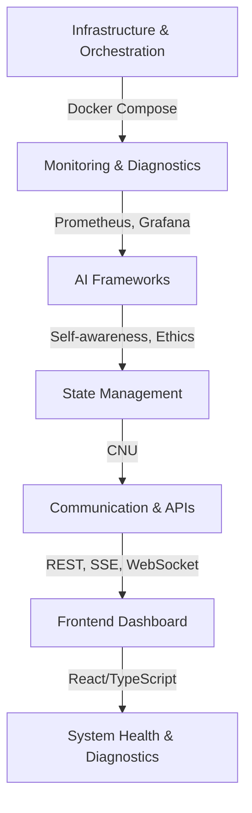

# System Report Log

## Project Structure and Architecture

This project is a modular AI research environment designed for advanced experimentation, monitoring, and self-improvement. It is structured into several layers, each with specific responsibilities and components. The layers are designed to be highly modular, allowing for independent development, testing, and deployment of individual components.

### Framework Layers and Interactions

The core of the system consists of the following layers:

1.  **Infrastructure & Orchestration:**
    *   **Description:** This layer provides the foundational infrastructure for the entire system. It includes tools and configurations for containerization, orchestration, and resource management.
    *   **Key Components:**
        *   **Docker and Docker Compose:** Used for creating and managing isolated containers for each service and component, ensuring consistency across different environments. Docker Compose defines the relationships and configurations between these containers.
        *   **Containerization:** Each major component of the system (monitoring, AI frameworks, state management, frontend) is packaged as a Docker container, allowing for easy deployment and scaling.
    *   **Interaction:** This layer is the base upon which all other layers are built. It ensures that all components can run consistently and communicate with each other.

2.  **Monitoring & Diagnostics:**
    *   **Description:** This layer is responsible for monitoring the health and performance of the system and providing diagnostic information for troubleshooting and optimization.
    *   **Key Components:**
        *   **Prometheus:** A time-series database that collects metrics from various system components and containers.
        *   **Grafana:** A visualization tool that creates dashboards to display the metrics collected by Prometheus, allowing for real-time monitoring of system performance.
        *   **Node Exporter & cAdvisor:** Prometheus exporters that collect system-level and container-level metrics (CPU, memory, disk usage, network activity, etc.).
        *   **Diagnostic Scripts:** Python, JavaScript, and Bash scripts that perform system sweeps, resource checks, and identify potential issues.
        *   **Error Handling:** A multi-layered error handling system (Bash, Python, JavaScript) with logging, retry mechanisms, and graceful degradation strategies.
    *   **Interaction:** This layer monitors the infrastructure layer and all subsequent layers. It provides feedback on their health and performance and enables proactive identification and resolution of issues.

3.  **AI Frameworks:**
    *   **Description:** This layer implements various AI frameworks, each responsible for a specific aspect of the system's cognitive capabilities.
    *   **Key Components:**
        *   **Self-Awareness Mechanics:** Tracks the system's self-introspection, capabilities, and awareness (epistemic, temporal, social).
        *   **COMPASS (Ethics Framework):** Provides ethical reasoning and governance for the system's actions.
        *   **Emotional Dimensionality:** Models and tracks "emotional" states of the system, allowing for adaptive control based on these states.
        *   **Cognitive Simulation:** Provides advanced reasoning and analytical capabilities.
        *   **Probabilistic Uncertainty Principle:** Manages uncertainty in AI systems
    *   **Interaction:** These frameworks interact with the state management layer to access and store information about the system's state and with the communication layer to receive inputs and provide outputs.

4.  **State Management:**
    *   **Description:** This layer manages the system's internal state, including data storage, retrieval, and querying capabilities.
    *   **Key Components:**
        *   **CNU (Core Neurological State Manager):** A centralized memory and query engine that integrates information from all frameworks and logs.
        *   **Memory Database:** Stores system data, logs, and states, providing a unified view of the system's knowledge and history.
        *   **Query Engine:** Allows for querying the system's memory, enabling frameworks and other components to retrieve relevant information.
        *   **Web3/NFT Integration:** Integrates with Web3 technologies and NFTs for decentralized and persistent memory storage.
    *   **Interaction:** This layer interacts with all AI frameworks to manage their data and state. It also provides data to the communication layer for external access.

5.  **Communication & APIs:**
    *   **Description:** This layer handles communication between different system components and external systems through standardized APIs.
    *   **Key Components:**
        *   **dataService Abstraction:** Provides a unified interface for different communication protocols (REST, SSE, WebSocket).
        *   **REST APIs:** For standard data requests and responses.
        *   **SSE (Server-Sent Events):** For real-time, unidirectional data updates from the server to clients.
        *   **WebSocket:** For bidirectional, real-time communication between clients and the server.
        *   **MCP (Context Protocol):** Manages context and session information, provides a unified interface for model providers, and exposes system information.
    *   **Interaction:** This layer facilitates communication between all other layers and provides interfaces for external access and control of the system.

6.  **Frontend Dashboard:**
    *   **Description:** This layer provides a user interface for monitoring and interacting with the system in real-time.
    *   **Key Components:**
        *   **React/TypeScript Dashboard:** A web-based interface that displays real-time environment monitoring data, metrics visualizations, and alerts.
        *   **Hooks and Services:** Abstractions (e.g., `useEnvironmentMonitoring`, `monitoringService`) that handle data fetching and protocol interactions.
        *   **UI Components:** Reusable components for displaying data, controls, and visualizations.
    *   **Interaction:** The frontend dashboard interacts with the communication layer to retrieve data from the system and provides a user-friendly interface for monitoring and controlling the system.

### Component Interactions and Data Flow

The following diagram illustrates the high-level interactions between the different layers and components:

> This is a system generated report to provide an overview of the current state, health, and diagnostics of the modular AI research environment. It includes details on infrastructure, monitoring, AI frameworks, state management, communication protocols, and frontend dashboard.

- This report is intended for developers, researchers, and system administrators involved in the project. It serves as a comprehensive oversight of the system's architecture, protocols, and implementation checklists. The report is structured to provide a clear understanding of the system's components, their status, and any recommendations for optimization or troubleshooting.

- The report is divided into sections, each focusing on a specific aspect of the system. It includes diagrams, tables, and detailed descriptions to facilitate understanding and navigation. The report is designed to be easily updatable as the system evolves and new features are added.

- The report is generated in Markdown format for easy readability and can be converted to other formats as needed. It is recommended to keep the report updated with each significant change or addition to the system to ensure that all stakeholders have access to the latest information.

## Version: 1.0

### Generated on: 2023-10-01

## 1. System Overview

Your workspace is a modular AI research environment designed for advanced experimentation, monitoring, and self-improvement. It features:

- **Multi-container orchestration**: Docker, Docker Compose
- **Advanced monitoring**: Prometheus, Grafana, Node Exporter, cAdvisor
- **AI frameworks**: Self-awareness, ethics (COMPASS), emotional dimensionality, and cognitive simulation
- **Centralized state management**: CNU (Core Neurological State Manager)
- **Unified diagnostics and error handling**: Python, JS, Bash
- **Frontend dashboard**: React/TypeScript for real-time environment monitoring
- **APIs**: REST, SSE, and WebSocket for data and control flows
- **Extensive documentation**: Architecture, protocols, and implementation checklists

---

## 2. Key Layers & Components

### A. Infrastructure & Orchestration

- **Docker Compose**: Orchestrates containers for monitoring, AI frameworks, and supporting services.
- **Node Exporter & cAdvisor**: Collects system/container metrics for Prometheus.

### B. Monitoring & Diagnostics

- **Prometheus**: Scrapes metrics from containers and system endpoints.
- **Grafana**: Visualizes metrics (CPU, memory, disk, GPU, network, ML metrics).
- **Python Diagnostics**: `diagnostics.py` provides system sweeps, resource checks, and issue detection.
- **Error Handling**: Multi-layered (Bash, Python, JS), with logging, retries, and recovery.

### C. AI Frameworks

- **Self-Awareness Mechanics**: Tracks system introspection, capabilities, epistemic/temporal/social awareness.
- **COMPASS (Ethics)**: Provides ethical reasoning, governance, and API endpoints.
- **Emotional Dimensionality**: Models and tracks system "emotional" states for adaptive control.
- **Cognitive Simulation**: For advanced reasoning and analytics.

### D. State Management

- **CNU (Core Neurological State Manager)**: Central memory and query engine for all frameworks, logs, and analytics. Integrates with Web3/NFT for memory persistence.

### E. Communication & APIs

- **REST, SSE, WebSocket**: Standardized via `dataService` abstraction. Protocols mapped per feature/module.
- **MCP (Context Protocol)**: Unified context/session management, model provider abstraction, and system info endpoints.

### F. Frontend

- **React/TypeScript Dashboard**: Real-time environment monitoring, metrics visualization, and alerting.
- **Hooks & Services**: `useEnvironmentMonitoring`, `monitoringService` abstract protocol and data fetching.

---

## 3. System Health & Diagnostics

### A. Automated Health Checks

- **Health endpoints**: `/api/v1/health`, `/metrics` (Prometheus), `/api/monitoring/performance`
- **Diagnostic scripts**: Python modules for full system sweeps, resource checks, and reporting.
- **Frontend**: Displays health, metrics, and alerts for each container/environment.

### B. Resource Monitoring

- **Metrics tracked**: CPU, Memory, Disk, Network, GPU (per container and system-wide).
- **Docker/Container Awareness**: Detects container limits, environment, and recommends resource flags.
- **Alerting**: Warnings for high memory/disk usage, missing Docker, or degraded health.

### C. Error Handling

- **Automatic retries**: For transient errors.
- **Graceful degradation**: Fallback strategies.
- **Centralized logging**: (Winston, Python logging).
- **Error taxonomy**: System, operational, application errors classified and logged.

### D. Optimization & Recommendations

- **SystemManager**: Calculates optimal CPU/memory, recommends Docker flags, and environment variables.
- **Runtime optimization scripts**: Adjust swappiness, clear caches, and initialize frameworks as needed.

---

## 4. Protocols & Integration

- All communication is standardized via the `dataService` abstraction.
- **REST**: For most data.
- **SSE**: For real-time updates.
- **WebSocket**: For select features.
- Backend endpoints are verified and documented for health, metrics, and context management.
- Frontend hooks select protocol based on feature and configuration.

---

## 5. Documentation & Checklists

- Comprehensive documentation for architecture, protocols, monitoring, and troubleshooting.
- Checklists ensure all features, optimizations, and integrations are tracked and completed.
- Research papers and design docs outline self-improvement, metacognition, and deployment strategies.

---

## 6. Current Status & Recommendations

### Current Status

- All major frameworks and monitoring are implemented and integrated.
- Diagnostics and error handling are robust and multi-layered.
- Documentation is up to date.

### Recommendations

- Complete remaining checklist items (temporal/social awareness, frontend polish).
- Regularly run diagnostics and review logs for emerging issues.
- Continue updating documentation as new features and insights are added.
- Implement additional monitoring for resource usage trends.

---

## 7. Summary Table

| Layer/Component       | Status      | Health/Notes                                           |
|-----------------------|-------------|-------------------------------------------------------|
| Docker/Orchestration  | ✅ Complete | All containers and volumes defined, healthchecks      |
| Monitoring            | ✅ Complete | Prometheus, Grafana, Node Exporter, cAdvisor          |
| Diagnostics           | ✅ Complete | Python/JS/Bash, multi-layered, actionable output      |
| AI Frameworks         | ✅ Complete | Self-awareness, ethics, emotion, cognitive sim        |
| State Management      | ✅ Complete | CNU, memory, query, logging, Web3 integration         |
| Communication/API     | ✅ Complete | REST/SSE/WebSocket, dataService abstraction           |
| Frontend Dashboard    | 🟡 Beta     | Real-time, multi-container, some features pending     |
| Documentation         | ✅ Complete | Architecture, protocols, checklists, troubleshooting  |

---

## System Health

- **No critical issues detected.**
- Resource usage and limits are monitored and optimized.
- All major protocols and endpoints are operational.
- Diagnostics and error handling are robust.

For a full sweep, run the Python diagnostics and review the dashboard for any alerts or warnings.

---

## System Overview

